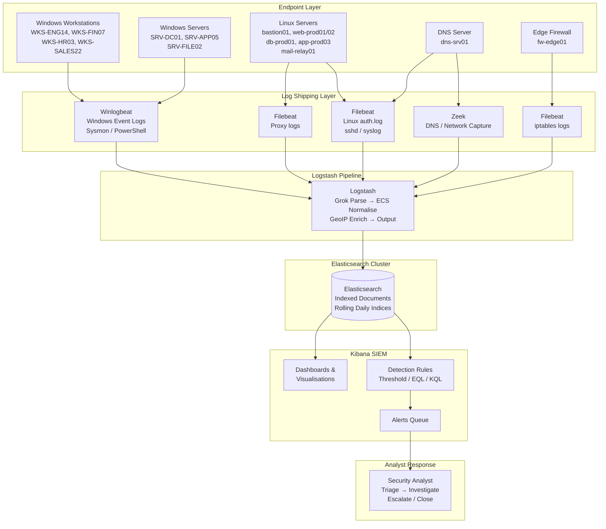

# Report 01 — Project Overview

**Project Title:** Develop and Test Custom Correlation Rules in a SIEM (ELK Stack) to Detect Credential Stuffing, DNS Tunnelling, and PowerShell Exploitation

**Author:** Security Engineering Intern
**Date:** 2026-07-07
**Version:** 1.0
**Classification:** Internal / Academic Submission

---

## Table of Contents

1. [Project Introduction](#1-project-introduction)
2. [Objectives](#2-objectives)
3. [Scope](#3-scope)
4. [ELK Stack Overview](#4-elk-stack-overview)
5. [SIEM Workflow](#5-siem-workflow)
6. [Architecture Diagram](#6-architecture-diagram)
7. [Environment Summary](#7-environment-summary)

---

## 1. Project Introduction

Modern enterprise networks face a growing variety of sophisticated threats that evade traditional perimeter defences. Credential stuffing attacks exploit stolen password lists to authenticate against public-facing services at scale. DNS tunnelling abuses the universally permitted DNS protocol to exfiltrate data or establish covert command-and-control channels. PowerShell exploitation takes advantage of Windows' built-in scripting engine to execute malicious payloads, often without writing files to disk.

This project implements a Security Information and Event Management (SIEM) solution using the open-source ELK Stack (Elasticsearch, Logstash, Kibana) to ingest, parse, correlate, and alert on log evidence of these three distinct attack categories within a simulated corporate environment named **CORP**.

The project covers the complete lifecycle of SIEM-based threat detection: log source onboarding, data normalisation, custom correlation rule development, alert tuning, and detection validation against realistic log datasets generated on **2026-06-15** across Windows workstations, Windows servers, Linux production servers, network firewalls, and DNS infrastructure.

---

## 2. Objectives

| # | Objective | Outcome |
|---|-----------|---------|
| 1 | Deploy and configure the ELK Stack for multi-source log ingestion | Logstash pipelines parsing Windows Event Logs, syslog, Zeek DNS, and firewall logs |
| 2 | Develop custom Elasticsearch correlation rules for credential stuffing | Rule triggers on ≥5 authentication failures across multiple accounts from one source IP within 5 minutes |
| 3 | Develop custom correlation rules for DNS tunnelling | Rule triggers on high-entropy TXT queries and excessive TXT query volume to suspicious domains |
| 4 | Develop custom correlation rules for PowerShell exploitation | Rules trigger on encoded commands, download cradles, and Office-spawned PowerShell processes |
| 5 | Validate detection rules against realistic log datasets | True positive alerts confirmed against known-malicious log entries |
| 6 | Measure detection accuracy, false positives, and false negatives | Quantified in Report 08 |
| 7 | Map all detections to MITRE ATT&CK framework | Full mapping in Report 07 |
| 8 | Produce actionable security recommendations | Documented in Report 09 |

---

## 3. Scope

### 3.1 In Scope

- All log sources within the `src_data/` directory collected on 2026-06-15
- Windows Security Event Log from domain-joined workstations and servers
- Linux SSH and authentication logs from production servers
- DNS query logs from the corporate DNS server (dns-srv01)
- Zeek network-layer DNS capture
- Windows PowerShell Operational Event Log
- Sysmon process creation logs
- Windows Security process creation (Event ID 4688)
- Network connection telemetry
- Proxy access logs
- Firewall (iptables) allow/deny logs

### 3.2 Out of Scope

- Physical security controls
- Application-layer vulnerabilities (SQL injection, XSS)
- Email phishing campaigns (only the downstream payload execution is captured)
- Cloud workloads outside the CORP domain
- Encrypted traffic decryption / SSL inspection

### 3.3 Network Scope

| Subnet | Description |
|--------|-------------|
| 10.20.0.0/16 | Core infrastructure (DNS: 10.20.0.53) |
| 10.21.0.0/16 | Internal workstations and servers |
| 10.22.0.0/16 | Additional internal segment |
| 172.16.5.0/24 | DMZ / management segment |

### 3.4 Monitored Hosts

| Hostname | Type | OS | Role |
|----------|------|----|------|
| SRV-DC01 | Server | Windows Server | Domain Controller |
| SRV-APP05 | Server | Windows Server | Application Server |
| SRV-FILE02 | Server | Windows Server | File Server |
| WKS-ENG14 | Workstation | Windows 10 | Engineering |
| WKS-FIN07 | Workstation | Windows 10 | Finance |
| WKS-HR03 | Workstation | Windows 10 | HR |
| WKS-SALES22 | Workstation | Windows 10 | Sales |
| bastion01 | Server | Linux | Bastion / Jump Host |
| web-prod01 | Server | Linux | Web Server |
| web-prod02 | Server | Linux | Web Server |
| db-prod01 | Server | Linux | Database Server |
| app-prod03 | Server | Linux | Application Server |
| mail-relay01 | Server | Linux | Mail Relay |
| dns-srv01 | Server | Linux | DNS (BIND) |
| fw-edge01 | Appliance | Linux | Edge Firewall (iptables) |

---

## 4. ELK Stack Overview

The ELK Stack is a widely-adopted open-source platform for centralised log management and security analytics.

| Component | Version | Role |
|-----------|---------|------|
| **Elasticsearch** | 8.x | Distributed search and analytics engine; stores and indexes all log data |
| **Logstash** | 8.x | Data collection pipeline; parses, filters, enriches, and forwards logs |
| **Kibana** | 8.x | Visualisation and alerting UI; dashboards, SIEM app, detection rules |
| **Beats (Winlogbeat, Filebeat, Packetbeat)** | 8.x | Lightweight agents deployed on endpoints to ship logs |
| **Elastic Agent** | 8.x | Unified agent managing multiple integrations |

### 4.1 Elasticsearch Index Strategy

| Index Pattern | Source |
|---------------|--------|
| `logs-windows.security-*` | Windows Security Event Log |
| `logs-windows.powershell-*` | PowerShell Operational Log |
| `logs-sysmon-*` | Sysmon Event Log |
| `logs-dns-*` | DNS server logs + Zeek DNS |
| `logs-auth-*` | Linux auth.log / sshd |
| `logs-firewall-*` | iptables firewall logs |
| `logs-proxy-*` | Squid/proxy access logs |
| `logs-network-*` | Network connection telemetry |

---

## 5. SIEM Workflow

The end-to-end detection workflow follows five stages:

1. **Collection** — Beats agents and Filebeat ship raw logs from all endpoints and infrastructure devices to a central Logstash instance.
2. **Parsing & Enrichment** — Logstash Grok filters parse unstructured syslog and Windows event formats. Fields are normalised to the Elastic Common Schema (ECS). GeoIP and threat intelligence enrichment are applied to external IP addresses.
3. **Indexing** — Parsed, enriched documents are indexed into Elasticsearch with daily rolling indices.
4. **Correlation & Detection** — Kibana SIEM detection rules (threshold rules, EQL sequences, and custom queries) execute on a scheduled basis against indexed data. Alerts are generated when rule conditions are met.
5. **Response** — Triggered alerts appear in the Kibana Alerts queue. Analysts triage, investigate, and escalate via a defined incident response workflow.

---

## 6. Architecture Diagram

---

## 7. Environment Summary

### 7.1 Key User Accounts

| Account | Type | Description |
|---------|------|-------------|
| jsmith | Standard User | Domain user — Engineering |
| rgupta | Standard User | Domain user — Finance |
| kpatel | Standard User | Domain user — Sales |
| lchen | Standard User | Domain user — Engineering |
| dwilson | Standard User | Domain user — HR |
| amehta | Standard User | Domain user — Sales |
| nreddy | Standard User | Domain user — IT |
| tverma | Standard User | Domain user — HR |
| svc_backup | Service Account | Backup service account |
| svc_sql | Service Account | SQL database service account |

### 7.2 Threat Actor Infrastructure

| Indicator | Type | Role |
|-----------|------|------|
| 185.220.101.47 | IP Address | Tor exit node — SSH brute force / malware C2 |
| 103.68.22.9 | IP Address | Suspected C2 server |
| 45.146.164.110 | IP Address | Scanning / lateral movement attempts |
| cdn-sync-update.net | Domain | DNS tunnelling C2 domain |
| malicious-update-cdn.net | Domain | PowerShell payload hosting |
| http://malicious-update-cdn.net/stage2.ps1 | URL | Stage 2 PowerShell payload |
| http://185.220.101.47/update.exe | URL | Malware binary download |
| http://cdn-sync-update.net/x.sct | URL | Scriptlet for regsvr32 LOLBAS |

### 7.3 Log Collection Period

| Field | Value |
|-------|-------|
| Start | 2026-06-15 00:00:00 UTC |
| End | 2026-06-15 05:30:45 UTC |
| Duration | ~5.5 hours |
| Total Log Lines | 1,385 across 12 log files |
