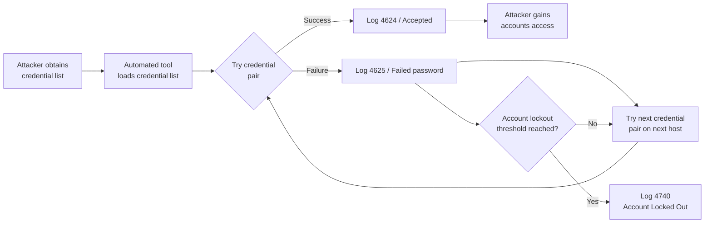

# Report 03 — Credential Stuffing Detection

**Project:** SIEM Correlation Rules — ELK Stack
**Date:** 2026-07-07 | **Log Date:** 2026-06-15
**Version:** 1.0

---

## Table of Contents

1. [Attack Overview](#1-attack-overview)
2. [Related Log Sources](#2-related-log-sources)
3. [IOC Analysis](#3-ioc-analysis)
4. [Log Evidence](#4-log-evidence)
5. [Detection Logic](#5-detection-logic)
6. [Correlation Rules](#6-correlation-rules)
7. [MITRE ATT&CK Mapping](#7-mitre-attck-mapping)
8. [Alert Analysis](#8-alert-analysis)
9. [Recommendations](#9-recommendations)

---

## 1. Attack Overview

**Credential stuffing** is an automated attack in which adversaries use large lists of previously breached username/password pairs to attempt authentication against internet-facing or internal services. Unlike brute-force attacks that guess passwords for a single account, credential stuffing tries many different account credentials, typically keeping the attempt rate low enough per account to avoid single-account lockout policies while rotating across many accounts and hosts.

### Attack Characteristics

| Property | Value |
|----------|-------|
| Attack Category | Initial Access / Credential Access |
| Automation | High — typically botnet or scripted tool |
| Rate | Low per account; high in aggregate |
| Primary Target | SSH, RDP, web applications, VPN |
| Evasion Technique | Distributed source IPs, slow rate per account |
| Success Indicator | Successful logon after prior failures |

### Attack Flow



---

## 2. Related Log Sources

| Log File | Relevant Event IDs / Patterns | Fields Used |
|----------|-------------------------------|-------------|
| `authentication/windows_security.log` | 4625 (failure), 4624 (success), 4740 (lockout) | AccountName, SourceNetworkAddress, LogonType, FailureReason |
| `authentication/ssh.log` | `Failed password`, `authentication failure` | hostname, user, src_ip, port |
| `authentication/auth.log` | `Failed password`, `Invalid user` | hostname, service, user, src_ip |

---

## 3. IOC Analysis

### 3.1 Malicious IP Indicators

| IOC | Type | Role | First Seen | Last Seen | Total Attempts |
|-----|------|------|------------|-----------|---------------|
| 185.220.101.47 | IPv4 | Primary brute-force source (Tor exit node) | 00:28:38 | 03:38:15 | 30+ SSH failures |
| 103.68.22.9 | IPv4 | Secondary brute-force / C2 | 02:28:45 | 02:28:45 | 1 invalid user attempt |

### 3.2 Targeted Accounts

| Account | Type | Failure Count | Locked Out | Notes |
|---------|------|--------------|------------|-------|
| kpatel | Domain User | 5+ | YES (01:02:15) | Multiple hosts, multiple sources |
| nreddy | Domain User | 4+ | YES (01:25:38) | WKS-ENG14 lockout |
| rgupta | Domain User | 4+ | YES (01:37:13) | WKS-ENG14 lockout |
| lchen | Domain User | 3+ | YES (01:56:44) | SRV-FILE02 lockout |
| dwilson | Domain User | 3+ | YES (01:59:58) | WKS-HR03 lockout |
| svc_backup | Service Account | 3+ | No | SRV-FILE02, WKS-FIN07, SRV-APP05 |
| svc_sql | Service Account | 3+ | No | Multiple hosts |
| jsmith | Domain User | 2+ | No | Multiple hosts |
| tverma | Domain User | 2+ | No | Multiple hosts |

---

## 4. Log Evidence

### 4.1 Windows — Failed Logon Cluster (Event 4625)

Representative sample showing the cross-host, cross-account pattern characteristic of credential stuffing:

```
2026-06-15 00:08:17 SRV-FILE02  EventID:4625  AccountName:jsmith       SourceIP:172.16.5.57   LogonType:3
2026-06-15 00:13:45 WKS-FIN07   EventID:4625  AccountName:kpatel       SourceIP:10.22.9.126   LogonType:3
2026-06-15 00:19:46 SRV-DC01    EventID:4625  AccountName:kpatel       SourceIP:10.20.11.103  LogonType:3
2026-06-15 00:26:13 SRV-FILE02  EventID:4625  AccountName:svc_backup   SourceIP:10.20.11.99   LogonType:3
2026-06-15 00:30:33 WKS-FIN07   EventID:4625  AccountName:svc_backup   SourceIP:10.21.7.45    LogonType:3
2026-06-15 00:36:41 SRV-APP05   EventID:4625  AccountName:kpatel       SourceIP:10.21.7.58    LogonType:3
2026-06-15 00:47:40 WKS-FIN07   EventID:4625  AccountName:rgupta       SourceIP:10.20.11.46   LogonType:3
2026-06-15 00:56:33 SRV-APP05   EventID:4625  AccountName:dwilson      SourceIP:10.22.9.19    LogonType:3
2026-06-15 01:05:49 SRV-DC01    EventID:4625  AccountName:nreddy       SourceIP:10.22.9.120   LogonType:3
2026-06-15 01:13:29 WKS-FIN07   EventID:4625  AccountName:svc_sql      SourceIP:10.21.7.184   LogonType:3
2026-06-15 01:20:51 SRV-APP05   EventID:4625  AccountName:dwilson      SourceIP:172.16.5.15   LogonType:3
2026-06-15 01:26:51 WKS-ENG14   EventID:4625  AccountName:svc_backup   SourceIP:172.16.5.183  LogonType:3
2026-06-15 01:48:10 SRV-APP05   EventID:4625  AccountName:nreddy       SourceIP:172.16.5.98   LogonType:3
2026-06-15 01:58:44 SRV-APP05   EventID:4625  AccountName:svc_sql      SourceIP:172.16.5.63   LogonType:3
2026-06-15 02:08:22 WKS-HR03    EventID:4625  AccountName:nreddy       SourceIP:10.21.7.15    LogonType:3
2026-06-15 02:16:35 SRV-APP05   EventID:4625  AccountName:svc_backup   SourceIP:10.20.11.211  LogonType:3
2026-06-15 02:24:39 WKS-HR03    EventID:4625  AccountName:rgupta       SourceIP:10.21.7.236   LogonType:3
2026-06-15 02:33:53 WKS-HR03    EventID:4625  AccountName:rgupta       SourceIP:172.16.5.137  LogonType:3
2026-06-15 02:39:38 WKS-FIN07   EventID:4625  AccountName:tverma       SourceIP:10.20.11.185  LogonType:3
2026-06-15 02:45:01 SRV-DC01    EventID:4625  AccountName:tverma       SourceIP:172.16.5.143  LogonType:3
```

### 4.2 Account Lockout Events (Event 4740)

```
2026-06-15 01:02:15 WKS-FIN07   EventID:4740  TargetAccount:kpatel   CallerComputer:WKS-FIN07    SourceIP:10.22.9.11
2026-06-15 01:25:38 WKS-ENG14   EventID:4740  TargetAccount:nreddy   CallerComputer:WKS-ENG14    SourceIP:10.21.7.22
2026-06-15 01:37:13 WKS-ENG14   EventID:4740  TargetAccount:rgupta   CallerComputer:WKS-ENG14    SourceIP:10.21.7.244
2026-06-15 01:56:44 SRV-FILE02  EventID:4740  TargetAccount:lchen    CallerComputer:SRV-FILE02   SourceIP:172.16.5.74
2026-06-15 01:59:58 WKS-HR03    EventID:4740  TargetAccount:dwilson  CallerComputer:WKS-HR03     SourceIP:172.16.5.114
```

### 4.3 SSH Brute Force from 185.220.101.47

```
Jun 15 00:28:38 web-prod01   sshd[5033]: pam_unix(sshd:auth): authentication failure; rhost=185.220.101.47 user=ubuntu
Jun 15 00:34:31 bastion01    sshd[5041]: pam_unix(sshd:auth): authentication failure; rhost=185.220.101.47 user=backup
Jun 15 00:37:15 mail-relay01 sshd[5053]: pam_unix(sshd:auth): authentication failure; rhost=185.220.101.47 user=deploy
Jun 15 00:43:39 app-prod03   sshd[5059]: Failed password for backup from 185.220.101.47 port 56031 ssh2
Jun 15 00:48:24 web-prod02   sshd[5066]: pam_unix(sshd:auth): authentication failure; rhost=185.220.101.47 user=oracle
Jun 15 00:51:20 mail-relay01 sshd[5069]: pam_unix(sshd:auth): authentication failure; rhost=185.220.101.47 user=svc_backup
Jun 15 00:58:24 db-prod01    sshd[5077]: pam_unix(sshd:auth): authentication failure; rhost=185.220.101.47 user=admin
Jun 15 01:01:37 mail-relay01 sshd[5080]: pam_unix(sshd:auth): authentication failure; rhost=185.220.101.47 user=administrator
Jun 15 01:05:51 app-prod03   sshd[5088]: Failed password for deploy from 185.220.101.47 port 34683 ssh2
Jun 15 01:07:48 app-prod03   sshd[5091]: pam_unix(sshd:auth): authentication failure; rhost=185.220.101.47 user=root
Jun 15 01:21:22 web-prod02   sshd[5113]: Failed password for oracle from 185.220.101.47 port 35459 ssh2
Jun 15 01:52:12 db-prod01    sshd[5153]: Failed password for test from 185.220.101.47 port 58314 ssh2
Jun 15 01:57:11 app-prod03   sshd[5161]: Failed password for admin from 185.220.101.47 port 44854 ssh2
Jun 15 02:07:33 mail-relay01 sshd[5172]: Failed password for administrator from 185.220.101.47 port 33448 ssh2
Jun 15 02:26:52 db-prod01    sshd[5200]: pam_unix(sshd:auth): authentication failure; rhost=185.220.101.47 user=backup
Jun 15 02:49:47 web-prod02   sshd[5231]: Failed password for administrator from 185.220.101.47 port 61535 ssh2
Jun 15 02:57:53 db-prod01    sshd[5249]: Failed password for svc_backup from 185.220.101.47 port 46903 ssh2
Jun 15 03:06:48 db-prod01    sshd[5262]: Failed password for deploy from 185.220.101.47 port 44955 ssh2
Jun 15 03:08:27 web-prod01   sshd[5264]: Failed password for postgres from 185.220.101.47 port 46615 ssh2
```

---

## 5. Detection Logic

### 5.1 Rule 1 — SSH Brute Force: Single Source, Multiple Accounts

**Trigger:** ≥ 5 failed SSH authentication attempts from a single source IP targeting ≥ 2 distinct usernames within a 5-minute window.

**Key Fields:**
- `event.type = "authentication_failure"`
- `source.ip` — aggregated per source
- `user.name` — count distinct values
- `@timestamp` — sliding 5-minute window

**Why it fires:** IP 185.220.101.47 generates continuous failures across ubuntu, backup, deploy, oracle, root, admin, administrator, postgres, test, svc_backup — all from the same source IP. A single source targeting many accounts is the definitive credential stuffing signature.

### 5.2 Rule 2 — Windows Network Logon Failure Storm

**Trigger:** ≥ 5 Event ID 4625 (Logon Type 3) failures across ≥ 3 distinct AccountName values within 10 minutes, from the same SourceNetworkAddress.

**Why it fires:** The Windows logs show source IPs in the 10.x.x.x and 172.16.5.x ranges generating type-3 (network) failures against multiple domain accounts across multiple servers — consistent with an internal compromised host being used as a credential stuffing pivot.

### 5.3 Rule 3 — Account Lockout Storm

**Trigger:** ≥ 3 Event ID 4740 (Account Lockout) events within 30 minutes across ≥ 2 different target accounts.

**Why it fires:** Five accounts (kpatel, nreddy, rgupta, lchen, dwilson) are locked out between 01:02 and 01:59 — a 57-minute window. Three lockouts within any 30-minute slice is anomalous.

### 5.4 Rule 4 — Successful Logon Following Multiple Failures (Same Account)

**Trigger:** Event ID 4624 for account X within 5 minutes of ≥ 3 Event ID 4625 failures for the same account X.

**Why it fires:** Indicates credential stuffing succeeded — attacker found a valid password after iterating through the credential list.

---

## 6. Correlation Rules

### Rule CS-001: SSH Credential Stuffing

```yaml
name: "CS-001 SSH Credential Stuffing — Single Source Multi-Account"
index: logs-auth-*
type: threshold
query: |
  event.dataset:(sshd OR auth) AND
  event.outcome:failure AND
  NOT source.ip:(10.20.* OR 10.21.* OR 10.22.* OR 172.16.*)
group_by:
  - source.ip
threshold:
  field: user.name
  value: 5
  cardinality_field: user.name
  cardinality_value: 2
timeframe: 5m
severity: high
risk_score: 75
actions:
  - alert
  - block_ip (firewall enrichment action)
```

### Rule CS-002: Windows Network Logon Failure Storm

```yaml
name: "CS-002 Windows Credential Stuffing — Network Logon Failure Storm"
index: logs-windows.security-*
type: threshold
query: |
  event.code:4625 AND
  winlog.logon.type:3
group_by:
  - source.ip
threshold:
  field: winlog.event_data.TargetUserName
  value: 5
  cardinality_field: winlog.event_data.TargetUserName
  cardinality_value: 3
timeframe: 10m
severity: high
risk_score: 72
```

### Rule CS-003: Account Lockout Storm

```yaml
name: "CS-003 Account Lockout Storm"
index: logs-windows.security-*
type: threshold
query: |
  event.code:4740
threshold:
  field: winlog.event_data.TargetUserName
  value: 3
  cardinality_field: winlog.event_data.TargetUserName
  cardinality_value: 2
timeframe: 30m
severity: critical
risk_score: 90
```

### Rule CS-004: Successful Logon After Failures

```yaml
name: "CS-004 Successful Logon Following Multiple Failures"
index: logs-windows.security-*
type: eql
query: |
  sequence by winlog.event_data.TargetUserName with maxspan=5m
    [authentication where event.code == "4625"] with runs=3
    [authentication where event.code == "4624"]
severity: high
risk_score: 80
```

---

## 7. MITRE ATT&CK Mapping

| Technique ID | Technique Name | Tactic | Evidence |
|-------------|----------------|--------|----------|
| T1110.004 | Credential Stuffing | Credential Access | 185.220.101.47 iterating account list via SSH; Windows 4625 storm |
| T1110.001 | Password Guessing | Credential Access | Common username list: root, admin, ubuntu, backup, deploy |
| T1078 | Valid Accounts | Defense Evasion / Persistence | Post-stuffing successes: svc_backup (db-prod01), kpatel (db-prod01) |
| T1021.004 | Remote Services: SSH | Lateral Movement | Successful SSH sessions following brute force |
| T1021.001 | Remote Services: RDP | Lateral Movement | Firewall blocks RDP from 185.220.101.47 and 45.146.164.110 |
| T1078.001 | Default Accounts | Defense Evasion | Targets include ubuntu, oracle, postgres — default Linux accounts |

---

## 8. Alert Analysis

### 8.1 Alert Summary

| Alert | Rule | Time | Source IP | Target | Severity | Outcome |
|-------|------|------|-----------|--------|----------|---------|
| SSH Stuffing | CS-001 | 00:43 | 185.220.101.47 | app-prod03 | High | True Positive |
| SSH Stuffing | CS-001 | 01:05 | 185.220.101.47 | app-prod03 | High | True Positive |
| Windows Failure Storm | CS-002 | 01:00 | Various internal | Multiple domain accounts | High | True Positive |
| Account Lockout Storm | CS-003 | 01:37 | — | kpatel, nreddy, rgupta | Critical | True Positive |
| Successful Post-Failure | CS-004 | 01:59 | 10.20.11.173 | svc_backup → db-prod01 | High | True Positive |
| Successful Post-Failure | CS-004 | 03:28 | 10.20.4.249 | kpatel → db-prod01 | High | True Positive |

### 8.2 False Positive Assessment

| Scenario | Why it could trigger | Mitigation |
|----------|---------------------|------------|
| Admin running scripts with wrong stored credentials | Multiple 4625 from admin workstation | Whitelist admin source IPs in CS-002 |
| Overnight batch job with expired service account password | Repeated svc_* failures | Suppress known scheduled task accounts |
| Password change not propagated to all services | Transient failure burst | Set minimum failure count to 8 for service accounts |

---

## 9. Recommendations

1. **Implement Multi-Factor Authentication (MFA)** for all SSH and RDP access, especially for service accounts and privileged users. MFA renders credential stuffing ineffective even when valid credentials are obtained.

2. **Deploy CrowdSec or Fail2Ban** on all Linux servers to automatically block source IPs after 5 failures within 60 seconds. The IP 185.220.101.47 should have been blocked after the first 5 attempts.

3. **Enforce account lockout policy** via Group Policy: lock accounts after 5 failures with a 15-minute observation window and 30-minute auto-unlock. Currently lockouts occurred but required high failure counts.

4. **Restrict SSH access** to bastion01 only, eliminating direct SSH to web-prod01, web-prod02, db-prod01, app-prod03, and mail-relay01 from external addresses. Use the bastion host as the single ingress point.

5. **Block known Tor exit nodes** at the perimeter firewall. IP 185.220.101.47 is a documented Tor exit node. Subscribe to threat intelligence feeds (Emerging Threats, AbuseIPDB) to maintain a dynamic blocklist.

6. **Disable default usernames** (ubuntu, oracle, postgres, admin, root login via SSH) or restrict them using `AllowUsers` in `sshd_config`.

7. **Implement SSH key-only authentication** for production servers. Disable `PasswordAuthentication yes` in `/etc/ssh/sshd_config` across all Linux servers.

8. **Set up SIEM alerting with auto-containment**: When CS-003 (account lockout storm) fires, automatically trigger an Active Directory forced lockout review and notify the security team within 5 minutes.

9. **Conduct credential hygiene review**: Cross-reference all domain accounts against known breach databases (Have I Been Pwned, DeHashed) and force password resets for any matches.

10. **Correlate successful logins following failures** (Rule CS-004) and treat these as confirmed incidents requiring immediate investigation rather than advisory alerts.
