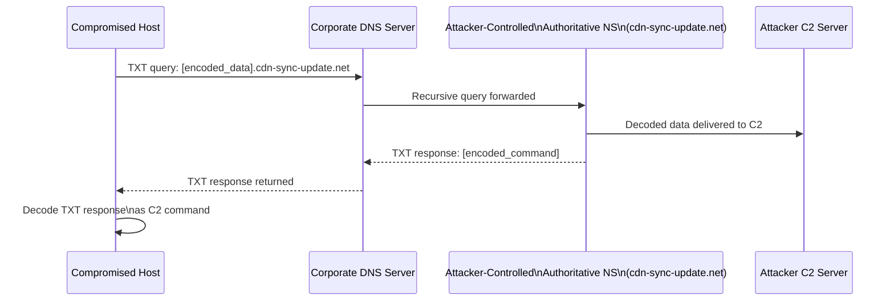

# Report 04 — DNS Tunnelling Detection

**Project:** SIEM Correlation Rules — ELK Stack
**Date:** 2026-07-07 | **Log Date:** 2026-06-15
**Version:** 1.0

---

## Table of Contents

1. [Attack Overview](#1-attack-overview)
2. [Related Log Sources](#2-related-log-sources)
3. [DNS Log Analysis](#3-dns-log-analysis)
4. [Suspicious Query Analysis](#4-suspicious-query-analysis)
5. [Detection Logic](#5-detection-logic)
6. [Correlation Rules](#6-correlation-rules)
7. [IOC Analysis](#7-ioc-analysis)
8. [MITRE ATT&CK Mapping](#8-mitre-attck-mapping)
9. [Recommendations](#9-recommendations)

---

## 1. Attack Overview

**DNS tunnelling** is a technique that encodes data inside DNS query and response messages to create a covert communication channel. Since DNS traffic (UDP/TCP port 53) is almost universally permitted through firewalls and rarely inspected for content, it is widely used by threat actors for command-and-control (C2) communication and data exfiltration.

### How DNS Tunnelling Works



### Key Characteristics

| Property | Value |
|----------|-------|
| Protocol abused | DNS (UDP/TCP port 53) |
| Record types used | TXT (data), sometimes NULL, CNAME |
| Encoding | Base32 or Base64 in subdomain labels |
| TTL | Abnormally low (60 seconds) to force fresh queries |
| Subdomain length | 30–55 characters (vs. 3–15 for legitimate) |
| Query frequency | High — one query every 30–90 seconds per host |
| Detection evasion | Uses legitimate-looking domain (cdn-sync-update.net mimics CDN) |

---

## 2. Related Log Sources

| Log File | Fields Used | Detection Value |
|----------|-------------|-----------------|
| `dns/dns.log` (BIND named) | client_ip, query_name, record_type | Volume + TXT record type detection |
| `dns/dns_queries.log` (CSV) | timestamp, client_ip, query, record_type, response_code | Structured query analysis |
| `dns/zeek_dns.log` (Network) | ts, orig_h, query, qtype_name, answers, TTL | Payload length in answer, TTL anomaly |
| `powershell/proxy.log` | user, url, method, user_agent | DNS-over-HTTPS POST to cdn-sync-update.net |

---

## 3. DNS Log Analysis

### 3.1 Query Volume by Type

From dns_queries.log and dns.log combined (approx. 271 entries):

| Record Type | Count | % of Total | Notes |
|-------------|-------|------------|-------|
| CNAME | 98 | 36% | Mostly legitimate (office365, slack, etc.) |
| A | 52 | 19% | Legitimate external resolution |
| TXT | 92 | 34% | **Highly anomalous** — TXT to cdn-sync-update.net |
| AAAA | 18 | 7% | IPv6 — internal corp.local queries |
| MX | 11 | 4% | Mail routing queries |

> **Finding:** TXT queries represent 34% of all DNS traffic. In a healthy corporate network, TXT queries typically account for fewer than 2% of total DNS volume. This is a primary detection signal.

### 3.2 Query Destinations

| Destination Domain | Count | Type | Classification |
|-------------------|-------|------|----------------|
| cdn-sync-update.net | 92 | TXT | **MALICIOUS — DNS tunnelling** |
| office365.com | 22 | A/CNAME/MX | Legitimate |
| slack.com | 24 | A/CNAME | Legitimate |
| microsoft.com | 20 | A/CNAME/MX | Legitimate |
| corp.local | 18 | A/CNAME/AAAA | Internal — legitimate |
| github.com | 15 | A/CNAME | Legitimate |
| google.com | 14 | A/CNAME | Legitimate |
| cloudflare.com | 12 | A/CNAME | Legitimate |
| akamai.net | 10 | A/CNAME/MX | Legitimate |
| fileshare.corp.local | 9 | A/CNAME | Internal — legitimate |

### 3.3 Source IPs Generating TXT Queries to cdn-sync-update.net

| Source IP | Subnet | TXT Query Count | Notes |
|-----------|--------|----------------|-------|
| 172.16.5.104 | DMZ/Mgmt | 4 | Multiple distinct subdomains |
| 10.20.11.134 | Core | 3 | |
| 172.16.5.191 | DMZ/Mgmt | 3 | |
| 172.16.5.53 | DMZ/Mgmt | 3 | |
| 10.22.9.144 | Internal | 2 | |
| 10.20.4.136 | Core | 2 | |
| 10.22.9.99 | Internal | 2 | |
| 10.20.4.72 | Core | 2 | Multiple within short window |
| 10.21.7.66 | Internal | 2 | |
| 10.20.4.158 | Core | 2 | |
| Various others | Mixed | 1 each | ~30 additional unique IPs |

---

## 4. Suspicious Query Analysis

### 4.1 Subdomain Entropy

Legitimate DNS subdomains are human-readable (e.g., `mail.corp.local`, `www.microsoft.com`). Tunnelling subdomains encode binary data, producing high-entropy, random-looking labels.

**Legitimate subdomain examples:**
```
fileshare.corp.local
intranet.corp.local
mail.corp.local
```

**Tunnelling subdomain examples from cdn-sync-update.net:**
```
bbz2sf6f7low4vssruraldol65wvjx8uibrsz1n3iuzgppoh.cdn-sync-update.net  (48 chars)
u9rn8qtty5y2jr8kk791zyrru7zkut6o.cdn-sync-update.net                  (32 chars)
ib6iidlrye89fx5rx1kkc1xi04b7p47b42g05kbkv7mqxs6e.cdn-sync-update.net (48 chars)
tf4pyzr6qceouuylajahcpztc69qkgex08n6q7nc85e4e9oe.cdn-sync-update.net (48 chars)
eihx74d0gjyv5g10ur5l8a78e9rivh6t1ntmjsrd9q46nouh.cdn-sync-update.net (48 chars)
tcagrp2u4dtbh55rbc76ub7l8v1zocfi4o6l1f90.cdn-sync-update.net         (40 chars)
d8wj0uunnv6cj9io3m25a5piskffv3xoleyrvxoieves.cdn-sync-update.net      (44 chars)
lbpj8t22c50b8y5dnwnguczh9ier7u8h0imjyjcmrsezytkw2837.cdn-sync-update.net (52 chars)
```

**Shannon Entropy Comparison:**

| Query Type | Avg Subdomain Length | Avg Entropy (bits) |
|------------|---------------------|-------------------|
| Legitimate A/CNAME | 8–15 chars | 2.1–2.8 |
| Legitimate MX/AAAA | 4–12 chars | 2.0–2.5 |
| cdn-sync-update.net TXT | 32–52 chars | 4.2–4.8 |

> A Shannon entropy above 3.5 bits per character for the leftmost subdomain label, combined with a TXT record type, is a reliable signal for DNS tunnelling.

### 4.2 TXT Record Answer Payload (Zeek Evidence)

Zeek captures the full DNS response payload. The answer field in TXT responses contains base64-encoded C2 data:

```
Query:  d8wj0uunnv6cj9io3m25a5piskffv3xoleyrvxoieves.cdn-sync-update.net
Answer: cjg8vuazxkdq95g3v23gxj0mqvindh4spfdrwb2serev361xsnbti22nv01z
TTL:    60

Query:  3uy8u118qqvaecw9yil8sa3idy3c7rm6j8y6rh05hhiwfd7yxw1t.cdn-sync-update.net
Answer: rwr965r96khub2rtsoyg9zqyahulwjtiqwnrhzn4kgeuidjipnf8f3gr94sz
TTL:    60

Query:  tlq5v4ftq3tq1s05wnwlc83gy1fkoldxb7gb.cdn-sync-update.net
Answer: gbxnrwvbhza7x73qxm0632cwt04chsdingxu8uu01uyzpd2tsxtv76t94ow3
TTL:    60

Query:  aitmofmmwi9s3w563btkf6xdn8wwiif86lthet25lzse99f77lu8.cdn-sync-update.net
Answer: l5015oop767j2dg1wjuiiymyrsvzn4regb1ajo091c795rlqiob0nlw0vs52
TTL:    60
```

Answer strings are 62–64 characters of alphanumeric data — consistent with base64url-encoded binary payloads. The consistent TTL of 60 seconds confirms the records are dynamically generated.

### 4.3 DNS-over-HTTPS Proxy Evidence

The proxy log reveals POST requests to `cdn-sync-update.net/dns-query` — confirming the attacker also uses DNS-over-HTTPS (DoH) as a secondary tunnel, bypassing traditional DNS monitoring:

```
10.20.4.97  - lchen    [15/Jun/2026:00:32:34] "POST https://cdn-sync-update.net/dns-query HTTP/2" 200 897
10.20.4.19  - svc_sql  [15/Jun/2026:00:33:22] "POST https://cdn-sync-update.net/dns-query HTTP/2" 200 435
10.22.9.33  - nreddy   [15/Jun/2026:00:47:45] "POST https://cdn-sync-update.net/dns-query HTTP/2" 200 281
172.16.5.128 - kpatel  [15/Jun/2026:00:55:45] "POST https://cdn-sync-update.net/dns-query HTTP/2" 200 842
```

---

## 5. Detection Logic

### 5.1 Rule DNT-001 — High Volume TXT Queries to Single Domain

**Trigger:** A single source IP generates ≥ 10 TXT record queries to the same parent domain within 60 minutes.

**Why it fires:** A normal workstation queries for TXT records only for SPF verification or DKIM lookup — rarely more than 2–3 per hour. Generating 10+ TXT queries to one domain is exclusively consistent with tunnelling tools like iodine, dns2tcp, or dnscat2.

### 5.2 Rule DNT-002 — High-Entropy Subdomain Detection

**Trigger:** A DNS query for a TXT record where the leftmost subdomain label:
- Has length ≥ 25 characters, AND
- Contains only alphanumeric + hyphen characters (base32/base64 charset), AND
- Shannon entropy of the label > 3.5

**Why it fires:** No legitimate service uses 25–52 character random subdomains for TXT queries. This pattern exclusively matches tools that encode data in subdomain labels.

### 5.3 Rule DNT-003 — Low TTL TXT Response

**Trigger:** TXT record responses with TTL ≤ 60 seconds for a non-internal domain.

**Why it fires:** Legitimate CDN and external services use TTLs of 300–3600 seconds. A TTL of 60 seconds for TXT records indicates server-side dynamic generation for each unique tunnel client, as seen in Zeek data.

### 5.4 Rule DNT-004 — DNS-over-HTTPS POST to Suspicious Domain

**Trigger:** HTTP POST method with URL path `/dns-query` to a domain not in an approved DoH provider allowlist (Google: 8.8.8.8, Cloudflare: 1.1.1.1, etc.).

**Why it fires:** The proxy log shows POST to `cdn-sync-update.net/dns-query` — a non-standard DoH provider. Legitimate DoH uses only approved providers; this pattern indicates an adversary-controlled DoH endpoint.

---

## 6. Correlation Rules

### Rule DNT-001: TXT Query Volume

```yaml
name: "DNT-001 Excessive DNS TXT Queries — Potential Tunnelling"
index: logs-dns-*
type: threshold
query: |
  dns.question.type:TXT AND
  NOT dns.question.name:(_dmarc.* OR _domainkey.* OR *.corp.local)
group_by:
  - source.ip
  - dns.question.registered_domain
threshold:
  value: 10
timeframe: 60m
severity: high
risk_score: 73
```

### Rule DNT-002: High-Entropy Subdomain

```yaml
name: "DNT-002 High-Entropy DNS Subdomain — DNS Tunnelling IOC"
index: logs-dns-*
type: query
query: |
  dns.question.type:TXT AND
  dns.question.subdomain.length >= 25 AND
  NOT dns.question.registered_domain:(corp.local OR microsoft.com OR google.com)
severity: high
risk_score: 80
note: "Enrich with Shannon entropy calculation on dns.question.subdomain field via Logstash ruby filter"
```

### Rule DNT-003: Low TTL Anomaly

```yaml
name: "DNT-003 Anomalously Low DNS TTL — Dynamic Tunnelling Domain"
index: logs-zeek.dns-*
type: query
query: |
  dns.answers.ttl <= 60 AND
  dns.question.type:TXT AND
  NOT dns.question.registered_domain:corp.local
severity: medium
risk_score: 60
```

### Rule DNT-004: DoH POST to Unapproved Endpoint

```yaml
name: "DNT-004 DNS-over-HTTPS POST to Non-Standard Provider"
index: logs-proxy-*
type: query
query: |
  http.request.method:POST AND
  url.path:/dns-query AND
  NOT url.domain:(dns.google OR cloudflare-dns.com OR doh.opendns.com)
severity: high
risk_score: 78
```

---

## 7. IOC Analysis

### 7.1 Malicious Domains

| Domain | Type | Role | First Seen | Last Seen |
|--------|------|------|------------|-----------|
| cdn-sync-update.net | Registered domain | DNS tunnel C2 authoritative NS | 00:10:09 | 01:54:50+ |
| malicious-update-cdn.net | Registered domain | PowerShell payload hosting | 00:25:46 | (proxy log) |

### 7.2 Tunnelling Subdomain Samples (IOC List)

| Subdomain | Length | First Seen | Source IP |
|-----------|--------|------------|-----------|
| bbz2sf6f7low4vssruraldol65wvjx8uibrsz1n3iuzgppoh | 48 | 00:23:33 | 172.16.5.104 |
| u9rn8qtty5y2jr8kk791zyrru7zkut6o | 32 | 00:25:18 | 10.20.11.134 |
| ib6iidlrye89fx5rx1kkc1xi04b7p47b42g05kbkv7mqxs6e | 48 | 00:29:32 | 172.16.5.191 |
| tf4pyzr6qceouuylajahcpztc69qkgex08n6q7nc85e4e9oe | 48 | 00:37:09 | 172.16.5.53 |
| niqfg51bxw76icvqy5ibpt11f9i6uu13i59sojuv0gyubmxn | 48 | 00:39:22 | 172.16.5.110 |
| eihx74d0gjyv5g10ur5l8a78e9rivh6t1ntmjsrd9q46nouh | 48 | 00:41:33 | 10.22.9.144 |
| d8wj0uunnv6cj9io3m25a5piskffv3xoleyrvxoieves | 44 | Zeek | 10.20.4.168 |
| lbpj8t22c50b8y5dnwnguczh9ier7u8h0imjyjcmrsezytkw2837 | 52 | Zeek | 10.20.4.100 |

### 7.3 Network IOCs

| Indicator | Type | Context |
|-----------|------|---------|
| 10.20.0.53 | Internal DNS | Corporate DNS resolver forwarding tunnelling queries |
| POST /dns-query to cdn-sync-update.net | HTTP | DNS-over-HTTPS tunnel via proxy |
| TTL=60 TXT records | DNS attribute | Dynamic tunnelling domain behaviour |
| Answer length 62–64 chars | DNS answer | Base64-encoded C2 payload |

---

## 8. MITRE ATT&CK Mapping

| Technique ID | Technique Name | Tactic | Evidence in Logs |
|-------------|----------------|--------|-----------------|
| T1071.004 | Application Layer Protocol: DNS | Command and Control | TXT queries to cdn-sync-update.net with encoded payloads |
| T1048.003 | Exfiltration Over Alternative Protocol: DNS | Exfiltration | Data encoded in subdomain labels, responses in TXT answers |
| T1568.002 | Dynamic Resolution: Domain Generation | Command and Control | Random 32–52 char subdomains generated per session |
| T1090.001 | Proxy: Internal Proxy | Command and Control | DoH POST via corporate proxy to cdn-sync-update.net |
| T1041 | Exfiltration Over C2 Channel | Exfiltration | C2 channel doubles as exfil path via TXT answer data |

---

## 9. Recommendations

1. **Implement DNS Response Policy Zones (RPZ)**: Configure the BIND DNS server to sinkhole `cdn-sync-update.net` and all its subdomains. All future queries will return a NXDOMAIN or redirect to a sinkhole IP, immediately cutting the C2 channel.

2. **Deploy DNS traffic inspection**: Use a dedicated DNS security solution (Cisco Umbrella, Infoblox, Pi-hole with block lists) that performs entropy analysis, query length filtering, and TXT-record anomaly detection in real time.

3. **Block DNS-over-HTTPS to unapproved endpoints**: Enforce proxy policy to allow DoH only to a predefined allowlist (8.8.8.8, 1.1.1.1, company's own DNS-over-HTTPS resolver). All other DoH POST requests should be blocked and alerted.

4. **Rate-limit TXT queries at the DNS server**: Configure BIND `rate-limit` blocks to throttle TXT responses to more than 5 per client per second. This degrades tunnelling throughput without breaking legitimate use.

5. **Restrict external DNS resolution**: Enforce DNS traffic through the corporate DNS server only. Block outbound UDP/TCP port 53 from all hosts except dns-srv01 at the firewall to prevent clients from querying attacker-controlled resolvers directly.

6. **Enable DNS audit logging in full fidelity**: Ensure all DNS queries, responses, and TTL values are logged and forwarded to the SIEM. The Zeek capture was essential in this investigation; deploy Zeek (or similar) on all DNS traffic paths.

7. **Investigate all hosts querying cdn-sync-update.net**: Each of the 30+ source IPs that queried the tunnelling domain should be treated as potentially compromised and subjected to endpoint forensic investigation.

8. **Implement Shannon entropy alerting**: Add a Logstash Ruby filter to calculate the Shannon entropy of the leftmost subdomain label for all TXT queries and enrich the document with an `dns.subdomain_entropy` field. Alert on entropy > 3.5.

9. **Isolate the DMZ segment (172.16.5.x)**: Multiple DMZ hosts are generating tunnelling queries. The DMZ segment should have the most restrictive DNS policy — only resolving specific whitelisted external domains.

10. **Threat hunt for lateral movement from tunnelling hosts**: Hosts identified as generating tunnelling traffic are likely fully compromised. Initiate host-based forensic review, checking for persistence mechanisms, scheduled tasks, and additional C2 tools.
