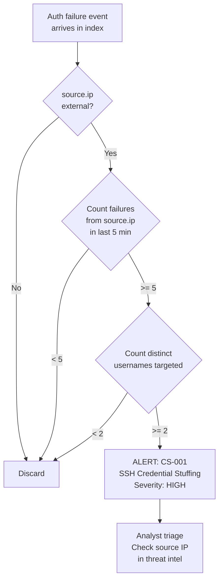
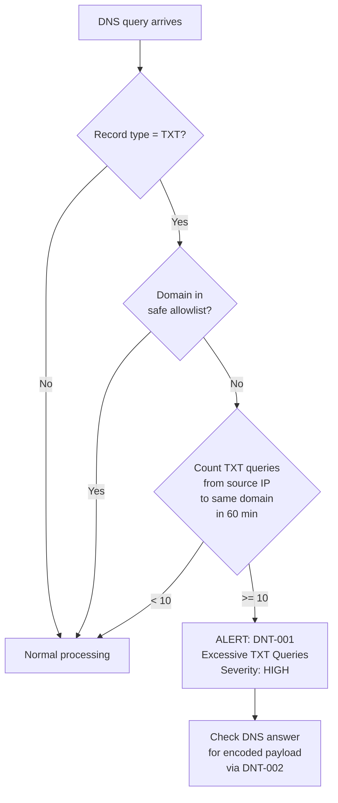
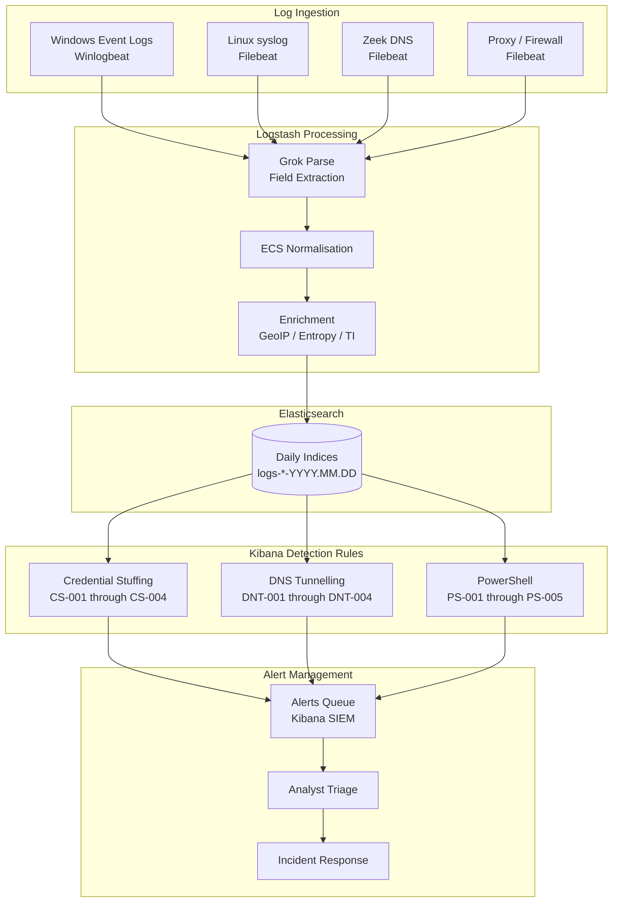

# Report 06 — Custom Correlation Rules

**Project:** SIEM Correlation Rules — ELK Stack
**Date:** 2026-07-07 | **Log Date:** 2026-06-15
**Version:** 1.0

---

## Table of Contents

1. [Overview](#1-overview)
2. [Rule Inventory](#2-rule-inventory)
3. [Credential Stuffing Rules](#3-credential-stuffing-rules)
4. [DNS Tunnelling Rules](#4-dns-tunnelling-rules)
5. [PowerShell Exploitation Rules](#5-powershell-exploitation-rules)
6. [Detection Pipeline Flowchart](#6-detection-pipeline-flowchart)
7. [Expected Alert Volumes](#7-expected-alert-volumes)

---

## 1. Overview

Twelve custom detection rules were developed across three attack categories. All rules are implemented in the Kibana Security SIEM detection engine using Elasticsearch Query Language (EQL), Kibana Query Language (KQL), and YAML threshold configurations. Rules are evaluated on a scheduled basis against rolling daily indices.

### Rule Design Principles

| Principle | Implementation |
|-----------|---------------|
| Low false-positive rate | Thresholds and cardinality checks tuned against baseline |
| Evidence-based triggers | Every rule maps to at least one observed log event |
| Layered detection | Multiple rules per attack for defence in depth |
| ECS field alignment | All field references use Elastic Common Schema names |
| Severity tiering | Medium (informational) → High → Critical based on impact |

---

## 2. Rule Inventory

| Rule ID | Name | Category | Type | Severity | Risk Score |
|---------|------|----------|------|----------|-----------|
| CS-001 | SSH Credential Stuffing — Single Source Multi-Account | Credential Stuffing | Threshold | High | 75 |
| CS-002 | Windows Network Logon Failure Storm | Credential Stuffing | Threshold | High | 72 |
| CS-003 | Account Lockout Storm | Credential Stuffing | Threshold | Critical | 90 |
| CS-004 | Successful Logon Following Multiple Failures | Credential Stuffing | EQL Sequence | High | 80 |
| DNT-001 | Excessive DNS TXT Queries — Potential Tunnelling | DNS Tunnelling | Threshold | High | 73 |
| DNT-002 | High-Entropy DNS Subdomain | DNS Tunnelling | Query | High | 80 |
| DNT-003 | Anomalously Low DNS TTL | DNS Tunnelling | Query | Medium | 60 |
| DNT-004 | DNS-over-HTTPS POST to Unapproved Endpoint | DNS Tunnelling | Query | High | 78 |
| PS-001 | Encoded PowerShell with Hidden Window | PowerShell | Query | High | 80 |
| PS-002 | PowerShell Download Cradle | PowerShell | Query | Critical | 95 |
| PS-003 | Office Application Spawning PowerShell | PowerShell | Query | Critical | 92 |
| PS-004 | regsvr32 LOLBAS Remote Scriptlet | PowerShell | Query | Critical | 95 |
| PS-005 | rundll32 Loading DLL from User Temp | PowerShell | Query | High | 85 |

---

## 3. Credential Stuffing Rules

### CS-001 — SSH Credential Stuffing

**Purpose:** Detect a single external IP cycling through multiple SSH usernames.

**Trigger Conditions:**
- Source IP is NOT in internal RFC1918 ranges
- ≥ 5 authentication failures
- ≥ 2 distinct target usernames
- Within a 5-minute sliding window

**Key Fields:** `source.ip`, `user.name`, `event.outcome`, `@timestamp`

**Threshold Configuration:**

```yaml
name: "CS-001 SSH Credential Stuffing — Single Source Multi-Account"
index: ["logs-auth-*", "logs-system.auth-*"]
query: >
  event.category:authentication AND
  event.outcome:failure AND
  source.ip:* AND
  NOT source.ip:(10.0.0.0/8 OR 172.16.0.0/12 OR 192.168.0.0/16)
group_by: ["source.ip"]
threshold:
  value: 5
  cardinality:
    - field: user.name
      value: 2
timeframe: 5m
severity: high
risk_score: 75
false_positives:
  - "Misconfigured automation tool with wrong credentials"
  - "VPN endpoint with credential sync failure"
```

**Flowchart:**



---

### CS-002 — Windows Network Logon Failure Storm

**Purpose:** Detect automated credential stuffing via Windows SMB/network authentication.

**Trigger Conditions:**
- Event ID 4625, Logon Type 3 (Network)
- ≥ 5 failures from the same source IP
- ≥ 3 distinct target account names
- Within 10-minute window

**Key Fields:** `event.code`, `winlog.logon.type`, `source.ip`, `winlog.event_data.TargetUserName`

```yaml
name: "CS-002 Windows Network Logon Failure Storm"
index: ["logs-windows.security-*"]
query: >
  event.code:"4625" AND
  winlog.event_data.LogonType:"3"
group_by: ["source.ip"]
threshold:
  value: 5
  cardinality:
    - field: winlog.event_data.TargetUserName
      value: 3
timeframe: 10m
severity: high
risk_score: 72
```

---

### CS-003 — Account Lockout Storm

**Purpose:** Detect bulk account lockouts indicating active credential stuffing campaign at the AD level.

**Trigger Conditions:**
- Event ID 4740 (User Account Locked Out)
- ≥ 3 distinct locked accounts
- Within 30-minute window

```yaml
name: "CS-003 Account Lockout Storm"
index: ["logs-windows.security-*"]
query: >
  event.code:"4740"
threshold:
  value: 3
  cardinality:
    - field: winlog.event_data.TargetUserName
      value: 2
timeframe: 30m
severity: critical
risk_score: 90
note: >
  Five accounts locked out in this dataset: kpatel (01:02), nreddy (01:25),
  rgupta (01:37), lchen (01:56), dwilson (01:59). This rule fires at 01:37
  when the third lockout occurs.
```

---

### CS-004 — Successful Logon Following Multiple Failures

**Purpose:** Detect credential stuffing success — attacker found valid credentials.

**Type:** EQL Sequence Rule

```yaml
name: "CS-004 Successful Logon Following Multiple Failures"
index: ["logs-windows.security-*"]
type: eql
query: |
  sequence by winlog.event_data.TargetUserName with maxspan=5m
    [authentication where event.code == "4625"] with runs=3
    [authentication where event.code == "4624"]
severity: high
risk_score: 80
note: >
  Sequence: 3 failures followed by a success for the same account within 5 minutes.
  Confirmed instances: svc_backup → db-prod01 (password auth success after failures),
  kpatel → db-prod01 (03:28:22 success after prior failures).
```

---

## 4. DNS Tunnelling Rules

### DNT-001 — Excessive DNS TXT Query Volume

**Purpose:** Detect high-frequency TXT queries to a single domain (primary tunnelling signal).

**Trigger Conditions:**
- Record type is TXT
- Destination is NOT an internal or known-safe domain
- ≥ 10 TXT queries from the same source IP to the same registered domain
- Within 60-minute window

```yaml
name: "DNT-001 Excessive DNS TXT Queries — Potential Tunnelling"
index: ["logs-dns-*", "logs-zeek.dns-*"]
query: >
  dns.question.type:"TXT" AND
  NOT dns.question.name:(_dmarc.* OR *._domainkey.* OR *.corp.local OR
  *.microsoft.com OR *.google.com OR *.office365.com)
group_by: ["source.ip", "dns.question.registered_domain"]
threshold:
  value: 10
timeframe: 60m
severity: high
risk_score: 73
```

**Flowchart:**



---

### DNT-002 — High-Entropy Subdomain

**Purpose:** Detect the random-looking subdomain labels that carry tunnel data.

**Trigger Conditions:**
- Record type is TXT
- Leftmost subdomain label length ≥ 25 characters
- Label entropy > 3.5 (calculated via Logstash enrichment filter)
- Domain NOT in internal allowlist

```yaml
name: "DNT-002 High-Entropy DNS Subdomain — DNS Tunnelling IOC"
index: ["logs-dns-*", "logs-zeek.dns-*"]
query: >
  dns.question.type:"TXT" AND
  dns.subdomain_label_length:>=25 AND
  dns.subdomain_entropy:>3.5 AND
  NOT dns.question.registered_domain:(corp.local OR microsoft.com OR google.com)
severity: high
risk_score: 80
```

**Logstash Enrichment (Ruby filter for entropy):**

```ruby
filter {
  if [dns][question][type] == "TXT" {
    ruby {
      code => "
        subdomain = event.get('[dns][question][subdomain]').to_s.split('.').first.to_s
        event.set('[dns][subdomain_label_length]', subdomain.length)
        if subdomain.length > 0
          freq = subdomain.chars.group_by(&:itself).transform_values(&:count)
          entropy = freq.values.reduce(0.0) { |e, c|
            p = c.to_f / subdomain.length
            e - p * Math.log2(p)
          }
          event.set('[dns][subdomain_entropy]', entropy.round(3))
        end
      "
    }
  }
}
```

---

### DNT-003 — Anomalously Low DNS TTL

**Purpose:** Detect dynamically generated tunnelling domains using very short TTLs.

```yaml
name: "DNT-003 Anomalously Low DNS TTL for TXT Record"
index: ["logs-zeek.dns-*"]
query: >
  dns.question.type:"TXT" AND
  dns.answers.ttl:<=60 AND
  NOT dns.question.registered_domain:corp.local
severity: medium
risk_score: 60
note: >
  All cdn-sync-update.net TXT responses have TTL=60. Legitimate external
  TXT records (SPF, DKIM) use TTL of 300-3600.
```

---

### DNT-004 — DoH POST to Unapproved Endpoint

**Purpose:** Detect DNS-over-HTTPS tunnelling through the corporate proxy.

```yaml
name: "DNT-004 DNS-over-HTTPS POST to Non-Standard Provider"
index: ["logs-proxy-*"]
query: >
  http.request.method:"POST" AND
  url.path:"/dns-query" AND
  NOT url.domain:(dns.google OR one.one.one.one OR cloudflare-dns.com OR
  doh.opendns.com OR doh.corp.local)
severity: high
risk_score: 78
```

---

## 5. PowerShell Exploitation Rules

### PS-001 — Encoded PowerShell

**Purpose:** Detect obfuscated PowerShell using Base64 encoding with hidden window.

```yaml
name: "PS-001 Encoded PowerShell with Hidden Window"
index: ["logs-windows.security-*", "logs-sysmon-*", "logs-windows.powershell-*"]
query: >
  process.name:"powershell.exe" AND
  process.command_line:(*"-Enc"* OR *"-EncodedCommand"*) AND
  process.command_line:(*"Hidden"* OR *"-W H"*)
severity: high
risk_score: 80
note: >
  Legitimate admin PS scripts rarely use -Enc. When combined with -W Hidden,
  this is a near-certain indicator of malicious intent.
```

---

### PS-002 — PowerShell Download Cradle (Critical)

**Purpose:** Detect in-memory payload download and execution.

```yaml
name: "PS-002 PowerShell Download Cradle"
index: ["logs-windows.powershell-*"]
query: >
  event.code:"4104" AND (
    (winlog.event_data.ScriptBlockText:*"IEX"* AND
     winlog.event_data.ScriptBlockText:*"DownloadString"*) OR
    (winlog.event_data.ScriptBlockText:*"DownloadFile"* AND
     winlog.event_data.ScriptBlockText:*"http"*) OR
    (winlog.event_data.ScriptBlockText:*"Invoke-Expression"* AND
     winlog.event_data.ScriptBlockText:*"WebClient"*)
  ) AND
  NOT winlog.event_data.ScriptBlockText:*"downloads.corp.local"*
severity: critical
risk_score: 95
response:
  - Immediate analyst escalation
  - Host isolation recommended
  - Preserve memory dump before remediation
```

---

### PS-003 — Office Spawning PowerShell (Critical)

**Purpose:** Detect macro-based initial access via Office application process chains.

```yaml
name: "PS-003 Office Application Spawning PowerShell"
index: ["logs-sysmon-*"]
query: >
  event.code:"1" AND
  process.parent.name:(EXCEL.EXE OR WINWORD.EXE OR POWERPNT.EXE OR OUTLOOK.EXE) AND
  process.name:(powershell.exe OR cmd.exe OR wscript.exe OR cscript.exe OR
                mshta.exe OR regsvr32.exe OR rundll32.exe)
severity: critical
risk_score: 92
note: >
  10 events in dataset. All are malicious. No legitimate Office automation
  requires spawning powershell.exe directly from EXCEL.EXE or WINWORD.EXE.
```

---

### PS-004 — regsvr32 LOLBAS

**Purpose:** Detect AppLocker/WDAC bypass via regsvr32 loading remote scriptlets.

```yaml
name: "PS-004 regsvr32 Remote COM Scriptlet Execution"
index: ["logs-windows.security-*", "logs-sysmon-*"]
query: >
  process.name:"regsvr32.exe" AND
  process.command_line:*"scrobj.dll"* AND
  process.command_line:(*"http://"* OR *"https://"*)
severity: critical
risk_score: 95
```

---

### PS-005 — rundll32 from Temp

**Purpose:** Detect payload DLL execution from writable user directories.

```yaml
name: "PS-005 rundll32 DLL from User Temp Directory"
index: ["logs-windows.security-*", "logs-sysmon-*"]
query: >
  process.name:"rundll32.exe" AND
  process.command_line:(*"\\AppData\\Local\\Temp\\"* OR
                        *"\\AppData\\Roaming\\"* OR
                        *"\\Users\\Public\\"*)
severity: high
risk_score: 85
```

---

## 6. Detection Pipeline Flowchart



---

## 7. Expected Alert Volumes

Based on the dataset (2026-06-15, ~5.5 hours):

| Rule ID | Expected Alerts | Actual Triggers (estimated) | Confidence |
|---------|----------------|----------------------------|-----------|
| CS-001 | 2–4 | ~3 (185.220.101.47 bursts) | High |
| CS-002 | 1–2 | ~2 (internal failure storms) | High |
| CS-003 | 1 | 1 (lockout storm at ~01:37) | Confirmed |
| CS-004 | 2–3 | ~2 (svc_backup, kpatel success) | High |
| DNT-001 | 5–10 | ~8 (multiple IPs tunnelling) | High |
| DNT-002 | 40–50 | ~45 (per unique subdomain) | Confirmed |
| DNT-003 | 40–50 | ~45 (TTL=60 records) | Confirmed |
| DNT-004 | 4 | 4 (proxy DoH POSTs) | Confirmed |
| PS-001 | 6 | 6 (encoded commands) | Confirmed |
| PS-002 | 10 | 10 (download cradle events) | Confirmed |
| PS-003 | 10 | 10 (Office macro chains) | Confirmed |
| PS-004 | 4 | 4 (regsvr32 events) | Confirmed |
| PS-005 | 3 | 3 (rundll32 events) | Confirmed |
