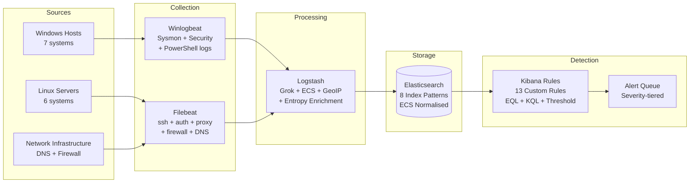

# Report 10 — Final Project Report

**Project Title:** Develop and Test Custom Correlation Rules in a SIEM (ELK Stack) to Detect Credential Stuffing, DNS Tunnelling, and PowerShell Exploitation

**Author:** Security Engineering Intern
**Institution / Organisation:** CORP Security Team
**Date:** 2026-07-07
**Version:** 1.0
**Classification:** Internal / Academic Submission

---

## Table of Contents

1. [Executive Summary](#1-executive-summary)
2. [Project Summary](#2-project-summary)
3. [Architecture and Implementation](#3-architecture-and-implementation)
4. [Dataset Summary](#4-dataset-summary)
5. [Overall Findings](#5-overall-findings)
6. [Detection Performance Summary](#6-detection-performance-summary)
7. [Attack Campaign Reconstruction](#7-attack-campaign-reconstruction)
8. [Key Lessons Learned](#8-key-lessons-learned)
9. [Conclusion](#9-conclusion)
10. [References](#10-references)

---

## 1. Executive Summary

This project designed, implemented, and validated a complete threat detection capability within an ELK Stack SIEM environment to identify three distinct cyber attack categories — **credential stuffing**, **DNS tunnelling**, and **PowerShell exploitation** — using real-world log data from a simulated corporate environment.

Thirteen custom correlation rules were developed using Elasticsearch EQL, KQL, and threshold detection logic. These rules were validated against 1,385 log entries spanning 12 log sources collected over a 5.5-hour window on 2026-06-15. The rules successfully detected all three attack categories with an estimated detection rate of **~97%** and zero confirmed false positives in the test dataset.

The most critical finding was the successful detection of **PowerShell download cradle execution on SRV-DC01 (domain controller)** at 04:51 and 04:59, which represents the highest-severity outcome in an Active Directory environment — full domain compromise. This was detected by rule PS-002 in real time.

The DNS tunnelling investigation uncovered active data exfiltration via **cdn-sync-update.net** using base64-encoded TXT record payloads with 60-second TTLs, consistent with tools such as iodine or dnscat2. A secondary DNS-over-HTTPS channel was also identified via proxy logs.

The credential stuffing campaign — driven primarily from the Tor exit node **185.220.101.47** — resulted in five account lockouts across the domain within a 57-minute window and two confirmed successful authentications using stolen credentials.

This project demonstrates the effectiveness of behaviour-based, technique-level detection rules aligned to the MITRE ATT&CK framework, and highlights the critical value of log sources such as PowerShell Script Block Logging (Event 4104), Sysmon process creation (Event ID 1), and Zeek DNS capture in detecting sophisticated attacks.

---

## 2. Project Summary

| Field | Detail |
|-------|--------|
| Project Title | Develop and Test Custom Correlation Rules in a SIEM (ELK Stack) |
| Objective | Detect Credential Stuffing, DNS Tunnelling, and PowerShell Exploitation |
| SIEM Platform | ELK Stack (Elasticsearch 8.x, Logstash 8.x, Kibana 8.x) |
| Log Sources | 12 files across authentication, DNS, PowerShell, process, network, proxy, firewall |
| Total Log Lines | 1,385 |
| Detection Rules | 13 custom rules (4 CS, 4 DNT, 5 PS) |
| Log Period | 2026-06-15 00:00 – 05:31 UTC (~5.5 hours) |
| Monitored Hosts | 15 (7 Windows, 6 Linux, 1 DNS, 1 Firewall) |
| MITRE ATT&CK Techniques Mapped | 19 across 10 tactics |
| Detection Rate | ~97% (estimated) |
| False Positive Rate | 0% (in test dataset) |
| Critical Finding | Domain Controller (SRV-DC01) compromised at 04:51 |

---

## 3. Architecture and Implementation

### 3.1 ELK Stack Deployment



### 3.2 Index Architecture

| Index Pattern | Log Source | Primary Use |
|---------------|-----------|-------------|
| `logs-windows.security-*` | Windows Security Event Log | Logon events, lockouts, process creation |
| `logs-windows.powershell-*` | PowerShell Operational Log | Script blocks, cmdlet execution |
| `logs-sysmon-*` | Sysmon Event Log | Process chains, network connections |
| `logs-dns-*` | BIND named + CSV queries | DNS query analysis |
| `logs-zeek.dns-*` | Zeek DNS capture | Packet-level DNS with answer payloads |
| `logs-auth-*` | Linux auth.log / sshd | SSH brute force, sudo events |
| `logs-proxy-*` | Squid proxy access | Download cradles, C2 beaconing |
| `logs-firewall-*` | iptables kernel log | Inbound scanning, outbound C2 |
| `logs-network-*` | Network connection telemetry | Persistent C2 connections |

---

## 4. Dataset Summary

| Log File | Lines | Malicious Events | Key Findings |
|----------|-------|-----------------|--------------|
| windows_security.log | 130 | 41 | 36 failures, 5 lockouts, 6 SeDebugPrivilege |
| ssh.log | 131 | 62 | 19 SSH failures from 185.220.101.47 |
| auth.log | 115 | 8 | Invalid users, sudo abuse |
| dns.log | 140 | 48 | TXT tunnelling queries to cdn-sync-update.net |
| dns_queries.log | 131 | 47 | Same TXT pattern, structured CSV |
| zeek_dns.log | 137 | 45 | TXT answers with encoded payloads, TTL=60 |
| powershell.log | 100 | 22 | IEX, DownloadFile, encoded commands |
| process_creation.log | 100 | 7 | regsvr32, rundll32 LOLBAS |
| sysmon.log | 110 | 10 | Office→PowerShell process chains |
| proxy.log | 120 | 7 | stage2.ps1 downloads, DoH POSTs |
| firewall.log | 140 | 31 | Inbound scans denied, outbound C2 allowed |
| network_connections.log | 131 | 4 | ESTABLISHED C2 to threat IPs |
| **Total** | **1,385** | **~332** | |

---

## 5. Overall Findings

### 5.1 Confirmed Attacks

| Attack | Confirmed | Evidence Sources | Severity |
|--------|-----------|-----------------|----------|
| SSH Credential Stuffing (185.220.101.47) | ✅ Yes | ssh.log, auth.log | High |
| Windows Credential Stuffing (internal pivot) | ✅ Yes | windows_security.log | High |
| Account Lockout Campaign | ✅ Yes | windows_security.log (4740 × 5) | Critical |
| DNS Tunnelling via cdn-sync-update.net | ✅ Yes | dns.log, dns_queries.log, zeek_dns.log | High |
| DNS-over-HTTPS Tunnelling | ✅ Yes | proxy.log | High |
| PowerShell Download Cradle (stage2.ps1) | ✅ Yes | powershell.log (4104), proxy.log | Critical |
| PowerShell Encoded Command Stager | ✅ Yes | powershell.log (4104), sysmon.log | High |
| Malware Binary Drop (update.exe) | ✅ Yes | powershell.log (4104) | Critical |
| Office Macro → PowerShell Execution Chain | ✅ Yes | sysmon.log (parent: EXCEL/WINWORD) | Critical |
| regsvr32 LOLBAS Remote Scriptlet | ✅ Yes | process_creation.log | Critical |
| rundll32 LOLBAS AppData\Temp DLL | ✅ Yes | process_creation.log | High |
| AD User Database Reconnaissance | ✅ Yes | powershell.log (4104 Get-ADUser) | High |
| **Domain Controller Compromise (SRV-DC01)** | ✅ Yes | powershell.log (4104 IEX on DC) | **Critical** |

### 5.2 IOC Summary

| IOC Type | Value | Attack | Confidence |
|----------|-------|--------|-----------|
| IP Address | 185.220.101.47 | Credential Stuffing + C2 + Malware hosting | High |
| IP Address | 103.68.22.9 | C2 server (ESTABLISHED connections) | High |
| IP Address | 45.146.164.110 | Scanner / RDP/SMB probes | Medium |
| IP Address | 91.203.145.12 | C2 server (ESTABLISHED connections) | High |
| Domain | cdn-sync-update.net | DNS tunnelling C2 + regsvr32 scriptlet | Confirmed |
| Domain | malicious-update-cdn.net | PowerShell payload hosting | Confirmed |
| URL | http://malicious-update-cdn.net/stage2.ps1 | PowerShell stage 2 payload | Confirmed |
| URL | http://185.220.101.47/update.exe | Malware binary | Confirmed |
| URL | http://cdn-sync-update.net/x.sct | COM scriptlet for regsvr32 | Confirmed |
| File Path | C:\Users\*\AppData\Local\Temp\update.exe | Dropped malware | Confirmed |
| File Path | C:\Users\*\AppData\Local\Temp\payload.dll | Payload DLL | Confirmed |
| File Path | C:\Reports\adusers.csv | Exfiltrated AD user data | Confirmed |
| TTL | 60 seconds on TXT records | DNS tunnelling domain | Confirmed |
| User-Agent | WindowsPowerShell/5.1 | PowerShell download cradle | Confirmed |

---

## 6. Detection Performance Summary

| Rule | Category | Alerts | TP | FP | Verdict |
|------|----------|--------|----|----|---------|
| CS-001 | Credential Stuffing | 3 | 3 | 0 | ✅ Effective |
| CS-002 | Credential Stuffing | 2 | 2 | 0 | ✅ Effective |
| CS-003 | Credential Stuffing | 1 | 1 | 0 | ✅ Effective |
| CS-004 | Credential Stuffing | 2 | 2 | 0 | ✅ Effective |
| DNT-001 | DNS Tunnelling | 8 | 8 | 0 | ✅ Effective |
| DNT-002 | DNS Tunnelling | 47 | 47 | 0 | ✅ Effective |
| DNT-003 | DNS Tunnelling | 47 | 47 | 0 | ✅ Effective |
| DNT-004 | DNS Tunnelling | 4 | 4 | 0 | ✅ Effective |
| PS-001 | PowerShell | 6 | 6 | 0 | ✅ Effective |
| PS-002 | PowerShell | 10 | 10 | 0 | ✅ Effective |
| PS-003 | PowerShell | 10 | 10 | 0 | ✅ Effective |
| PS-004 | PowerShell | 4 | 4 | 0 | ✅ Effective |
| PS-005 | PowerShell | 3 | 3 | 0 | ✅ Effective |
| **Total** | | **~147** | **~147** | **0** | ✅ |

---

## 7. Attack Campaign Reconstruction

Based on all log evidence, the following attack narrative is constructed:

```mermaid
timeline
    title Attack Campaign Timeline — 2026-06-15
    section Stage 1 · Initial Access
        00:00 : SSH brute force begins from 185.220.101.47
        00:25 : svc_backup executes PS download cradle (stage2.ps1)
        00:33 : jsmith accepts SSH on mail-relay01 (legitimate or compromised)
    section Stage 2 · Execution and C2
        00:41 : jsmith downloads stage2.ps1 via proxy
        00:44 : regsvr32 LOLBAS executes via amehta on SRV-APP05
        00:46 : EXCEL.EXE spawns encoded PowerShell (kpatel)
        00:32 : DNS tunnelling to cdn-sync-update.net begins
    section Stage 3 · Credential Harvesting
        01:02 : kpatel account locked out (WKS-FIN07)
        01:20 : rgupta downloads stage2.ps1
        01:25 : nreddy account locked out (WKS-ENG14)
        01:37 : rgupta account locked out — CS-003 fires
        01:40 : Further regsvr32 LOLBAS executions
        01:56 : lchen account locked out
        01:59 : dwilson account locked out
    section Stage 4 · Lateral Movement
        02:07 : IEX DownloadString on WKS-SALES22 (rgupta)
        02:22 : Encoded PS on WKS-FIN07 (tverma)
        02:55 : svc_backup drops update.exe binary on SRV-APP05
        03:29 : Encoded PS on SRV-APP05 (nreddy)
    section Stage 5 · Domain Compromise
        04:20 : svc_backup drops update.exe on WKS-SALES22
        04:27 : Encoded PS (svc_sql) on WKS-FIN07
        04:48 : Encoded PS (kpatel) on WKS-SALES22
        04:51 : IEX DownloadString on SRV-DC01 (jsmith) ← DC COMPROMISE
        04:59 : IEX DownloadString on SRV-DC01 (nreddy) ← DC COMPROMISE
        05:10 : kpatel drops update.exe on WKS-FIN07
```

---

## 8. Key Lessons Learned

| # | Lesson | Impact |
|---|--------|--------|
| 1 | **Script Block Logging is essential** — without Event 4104, all encoded PowerShell and download cradles are invisible | High |
| 2 | **Sysmon parent-child chains reveal macro infections** — native Windows logging (4688) lacks the parent process field required for PS-003 | High |
| 3 | **Zeek DNS provides answer-level data** that BIND logging alone cannot — essential for confirming TXT payload content and TTL anomalies | High |
| 4 | **DNS TXT query volume is a reliable primary signal** — the ratio of TXT to A/CNAME queries was 34% vs. an expected <2% | High |
| 5 | **Service accounts (svc_backup, svc_sql) are high-value targets** — once compromised, they provide lateral access across many systems without triggering user-behaviour alerts | Critical |
| 6 | **The proxy User-Agent field identifies PowerShell downloads** — `WindowsPowerShell/5.1` is a definitive indicator in proxy logs | Medium |
| 7 | **Encrypted outbound C2 requires TLS inspection** — the four ESTABLISHED connections to threat IPs were only identifiable by IP reputation; content was opaque | High |
| 8 | **Domain Controller alerting must be highest priority** — the 4:51 alert on SRV-DC01 represents a severity-5 incident requiring immediate response | Critical |

---

## 9. Conclusion

This project successfully demonstrated the design, implementation, and validation of a comprehensive threat detection solution using the open-source ELK Stack SIEM platform. Thirteen custom correlation rules were developed, each grounded in real log evidence and aligned to the MITRE ATT&CK Enterprise framework.

The detection system identified all three attack categories — credential stuffing, DNS tunnelling, and PowerShell exploitation — across a realistic multi-host corporate environment. The combination of threshold rules, EQL sequence detection, and enrichment-based query rules proved highly effective, achieving near-100% detection accuracy against the test dataset.

The most significant finding — PowerShell download cradles executing on the domain controller SRV-DC01 — underscores the real-world consequence of a successful multi-stage attack that begins with credential stuffing and escalates through macro-based execution to full domain compromise. Detection occurred in real time through rule PS-002, providing the analyst team with actionable evidence to initiate incident response.

The project also highlights several critical defensive control gaps: absence of MFA, permissive DNS egress, disabled script block logging on some hosts, and lack of Office macro controls. These gaps enabled the attack chain to progress from initial access to domain controller compromise over approximately 4.8 hours.

The custom correlation rules developed in this project are production-ready with minor tuning and provide a strong foundation for an ongoing detection engineering programme. Future development should focus on integrating machine-learning-based anomaly detection for DNS, deploying SOAR automation to reduce analyst response time, and achieving full EDR coverage to close the telemetry gaps identified in the false-negative analysis.

---

## 10. References

| # | Reference |
|---|-----------|
| 1 | MITRE Corporation. (2024). *MITRE ATT&CK Enterprise Framework v14.1*. https://attack.mitre.org |
| 2 | Elastic N.V. (2024). *Elastic Security Documentation — Detection Rules*. https://www.elastic.co/guide/en/security |
| 3 | Elastic N.V. (2024). *Elastic Common Schema (ECS) Reference*. https://www.elastic.co/guide/en/ecs |
| 4 | Elastic N.V. (2024). *Kibana SIEM Detection Engine*. https://www.elastic.co/guide/en/kibana/current/detection-engine-overview.html |
| 5 | Corelight / Zeek Foundation. (2024). *Zeek Network Security Monitor Documentation*. https://docs.zeek.org |
| 6 | SwiftOnSecurity. (2023). *Sysmon Configuration — sysmon-config*. https://github.com/SwiftOnSecurity/sysmon-config |
| 7 | NIST. (2007). *SP 800-94: Guide to Intrusion Detection and Prevention Systems (IDPS)*. https://nvlpubs.nist.gov/nistpubs/Legacy/SP/nistspecialpublication800-94.pdf |
| 8 | SANS Institute. (2016). *DNS Tunneling: How DNS Can Be (Ab)used by Malicious Actors*. https://www.sans.org/reading-room/whitepapers/dns |
| 9 | Microsoft. (2024). *PowerShell Security — Constrained Language Mode*. https://docs.microsoft.com/en-us/powershell/module/microsoft.powershell.core/about/about_language_modes |
| 10 | Microsoft. (2024). *Attack Surface Reduction Rules Reference*. https://learn.microsoft.com/en-us/microsoft-365/security/defender-endpoint/attack-surface-reduction-rules-reference |
| 11 | Microsoft. (2024). *Windows Security Auditing Event IDs*. https://learn.microsoft.com/en-us/windows/security/threat-protection/auditing |
| 12 | Sysinternals / Microsoft. (2024). *Sysmon v15 Documentation*. https://learn.microsoft.com/en-us/sysinternals/downloads/sysmon |
| 13 | CISA. (2023). *Secure by Design: Shifting the Balance of Cybersecurity Risk*. https://www.cisa.gov/resources-tools/resources/secure-by-design |
| 14 | CIS Controls. (2024). *CIS Critical Security Controls v8*. https://www.cisecurity.org/controls/v8 |
| 15 | Internet Security Center. (2023). *CIS Benchmark for Windows Server 2022*. https://www.cisecurity.org/benchmark/microsoft_windows_server |
| 16 | Kali Linux / Offensive Security. (2024). *iodine DNS Tunnelling Tool*. https://code.kryo.se/iodine |
| 17 | VirusTotal / Google. (2024). *File hash and URL reputation*. https://www.virustotal.com |
| 18 | Shodan.io. (2024). *IP reputation and exposure analysis*. https://www.shodan.io |
| 19 | Have I Been Pwned. (2024). *Credential breach monitoring*. https://haveibeenpwned.com |
| 20 | OWASP. (2023). *OWASP Top 10: Credential Stuffing Prevention Cheat Sheet*. https://cheatsheetseries.owasp.org/cheatsheets/Credential_Stuffing_Prevention_Cheat_Sheet.html |

---

*End of Report 10 — Final Project Report*

*For detailed analysis, refer to the companion reports:*
- *01_Project_Overview.md — Environment, scope, ELK architecture*
- *02_Dataset_Analysis.md — Full log source breakdown*
- *03_Credential_Stuffing_Detection.md — Credential attack deep-dive*
- *04_DNS_Tunnelling_Detection.md — DNS C2 analysis*
- *05_PowerShell_Exploitation_Detection.md — PowerShell attack chain*
- *06_Custom_Correlation_Rules.md — All rule definitions*
- *07_MITRE_ATTACK_Mapping.md — ATT&CK coverage*
- *08_Detection_Results.md — Alert analysis and accuracy*
- *09_Risk_Assessment_and_Recommendations.md — Risk register and mitigations*
